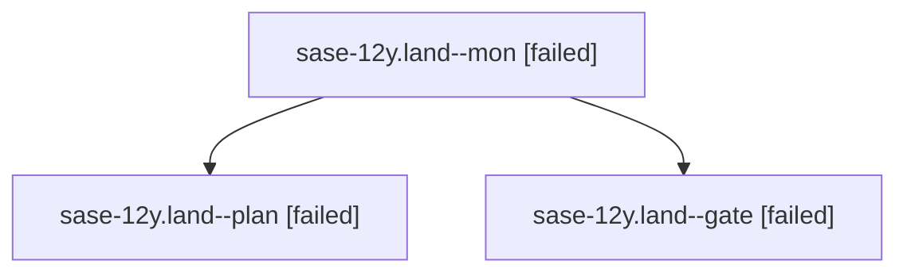

# Family: sase-12y.land

[Agent Hoods](../README.md) / [bbugyi200](../users/bbugyi200/README.md) / [apollo](../users/bbugyi200/machines/apollo/README.md) / [sase-12y](../users/bbugyi200/machines/apollo/hoods/sase-12y/README.md) / sase-12y.land

Owner: `bbugyi200.apollo` · Hood: `sase-12y` · Members: 3 · Bead: [sase-12y](https://github.com/sase-org/sase--beads/blob/main/pages/sase-12y/README.md)

## Lineage

The diagram is an optional enhancement; the ordered table below contains the same lineage in accessible text.

| Role | Agent | State | Model / provider | Timing | Commits | Prompt | Chat |
|---|---|---|---|---|---:|---|---|
| mon | sase-12y.land--mon | failed | gpt-5.6-sol / codex | 2026-09-19T00:07:58.546530+00:00 → 2026-09-19T00:09:49.734758+00:00 | 0 | — | [Chat](../agents/bbugyi200.apollo.sase-12y.land--mon/chat.md) |
| plan | sase-12y.land--plan | failed | gpt-5.6-sol / codex | 2026-09-18T22:13:07.653615+00:00 → 2026-09-19T00:08:16.587836+00:00 | 0 | [Prompt](../agents/bbugyi200.apollo.sase-12y.land--plan/prompt.md) | [Chat](../agents/bbugyi200.apollo.sase-12y.land--plan/chat.md) |
| gate | sase-12y.land--gate | failed | gpt-5.6-sol / codex | 2026-09-19T00:07:49.762238+00:00 → 2026-09-19T00:08:00.167341+00:00 | 0 | — | [Chat](../agents/bbugyi200.apollo.sase-12y.land--gate/chat.md) |

## Neighbors

| Agent | Relation | State |
|---|---|---|
| [sase-12y.1](../agents/bbugyi200.apollo.sase-12y.1/README.md) | sase-12y hood | completed |
| [sase-12y.2](bbugyi200.apollo.sase-12y.2.md) (family · 3) | sase-12y hood | completed 2, failed 1 |
| [sase-12y.3](bbugyi200.apollo.sase-12y.3.md) (family · 9) | sase-12y hood | completed 5, failed 4 |
| [sase-12y.4.1](../agents/bbugyi200.apollo.sase-12y.4.1/README.md) | sase-12y hood | active |
| [sase-12y.4.land](../agents/bbugyi200.apollo.sase-12y.4.land/README.md) | sase-12y hood | waiting |
