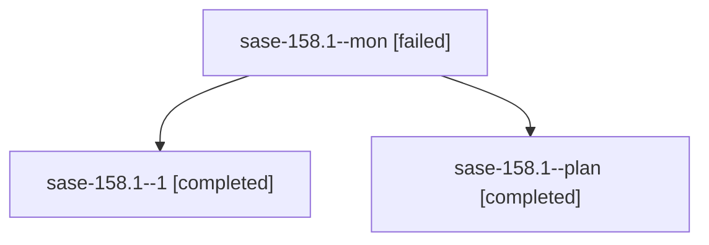

# Family: sase-158.1

[Agent Hoods](../README.md) / [bbugyi200](../users/bbugyi200/README.md) / [apollo](../users/bbugyi200/machines/apollo/README.md) / [sase-158](../users/bbugyi200/machines/apollo/hoods/sase-158/README.md) / sase-158.1

Owner: `bbugyi200.apollo` · Hood: `sase-158` · Members: 3 · Bead: [sase-158.1](https://github.com/sase-org/sase--beads/blob/main/pages/sase-158/sase-158.1.md)

## Lineage

The diagram is an optional enhancement; the ordered table below contains the same lineage in accessible text.

| Role | Agent | State | Model / provider | Timing | Commits | Prompt | Chat |
|---|---|---|---|---|---:|---|---|
| mon | sase-158.1--mon | failed | muse-spark-1.3-contributor / muse | 2026-09-21T12:33:12.442869+00:00 → 2026-09-21T13:19:08.613513+00:00 | 0 | — | [Chat](../agents/bbugyi200.apollo.sase-158.1--mon/chat.md) |
| 1 | sase-158.1--1 | completed | muse-spark-1.3-contributor / muse | 2026-09-21T13:19:08.342683+00:00 → 2026-09-21T13:33:33.612124+00:00 | [1](../agents/bbugyi200.apollo.sase-158.1--1/README.md#commits) | [Prompt](../agents/bbugyi200.apollo.sase-158.1--1/prompt.md) | [Chat](../agents/bbugyi200.apollo.sase-158.1--1/chat.md) |
| plan | sase-158.1--plan | completed | muse-spark-1.3-contributor / muse | 2026-09-21T11:51:35.053119+00:00 → 2026-09-21T12:33:58.943086+00:00 | 0 | [Prompt](../agents/bbugyi200.apollo.sase-158.1--plan/prompt.md) | [Chat](../agents/bbugyi200.apollo.sase-158.1--plan/chat.md) |

## Commits

| Role | Repo | Commit | Subject | Committed |
|---|---|---|---|---|
| 1 | sase | [`94ccd19`](https://github.com/sase-org/sase/commit/94ccd19176a50586b97c2f8add0d431d1097ed18) | feat(dev-update): add line-streaming subprocess runner with on\_output sink | 2026-09-21 09:28:42 EDT |

## Neighbors

| Agent | Relation | State |
|---|---|---|
| [sase-158.2](../agents/bbugyi200.apollo.sase-158.2/README.md) | sase-158 hood | active |
| [sase-158.3](../agents/bbugyi200.apollo.sase-158.3/README.md) | sase-158 hood | waiting |
| [sase-158.4](../agents/bbugyi200.apollo.sase-158.4/README.md) | sase-158 hood | waiting |
| [sase-158.5](../agents/bbugyi200.apollo.sase-158.5/README.md) | sase-158 hood | waiting |
| [sase-158.land](../agents/bbugyi200.apollo.sase-158.land/README.md) | sase-158 hood | waiting |
