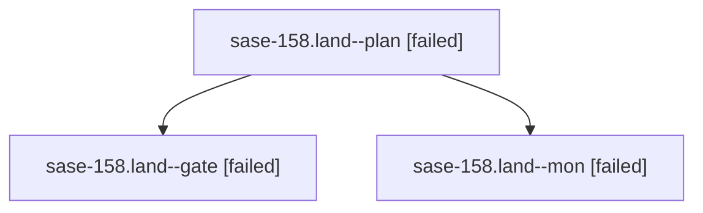

# Family: sase-158.land

[Agent Hoods](../README.md) / [bbugyi200](../users/bbugyi200/README.md) / [apollo](../users/bbugyi200/machines/apollo/README.md) / [sase-158](../users/bbugyi200/machines/apollo/hoods/sase-158/README.md) / sase-158.land

Owner: `bbugyi200.apollo` · Hood: `sase-158` · Members: 3 · Bead: [sase-158](https://github.com/sase-org/sase--beads/blob/main/pages/sase-158/README.md)

## Lineage

The diagram is an optional enhancement; the ordered table below contains the same lineage in accessible text.

| Role | Agent | State | Model / provider | Timing | Commits | Prompt | Chat |
|---|---|---|---|---|---:|---|---|
| plan | sase-158.land--plan | failed | opus / claude | 2026-09-21T19:02:01.170231+00:00 → 2026-09-21T20:19:06.504283+00:00 | 0 | [Prompt](../agents/bbugyi200.apollo.sase-158.land--plan/prompt.md) | [Chat](../agents/bbugyi200.apollo.sase-158.land--plan/chat.md) |
| gate | sase-158.land--gate | failed | opus / claude | 2026-09-21T20:18:33.658489+00:00 → 2026-09-21T20:18:41.965765+00:00 | 0 | — | [Chat](../agents/bbugyi200.apollo.sase-158.land--gate/chat.md) |
| mon | sase-158.land--mon | failed | opus / claude | 2026-09-21T20:18:41.107293+00:00 → 2026-09-21T20:20:17.434013+00:00 | 0 | — | [Chat](../agents/bbugyi200.apollo.sase-158.land--mon/chat.md) |

## Neighbors

| Agent | Relation | State |
|---|---|---|
| [sase-158.1](bbugyi200.apollo.sase-158.1.md) (family · 3) | sase-158 hood | completed 2, failed 1 |
| [sase-158.2](../agents/bbugyi200.apollo.sase-158.2/README.md) | sase-158 hood | completed |
| [sase-158.3](../agents/bbugyi200.apollo.sase-158.3/README.md) | sase-158 hood | completed |
| [sase-158.4](../agents/bbugyi200.apollo.sase-158.4/README.md) | sase-158 hood | completed |
| [sase-158.5](../agents/bbugyi200.apollo.sase-158.5/README.md) | sase-158 hood | completed |
| [sase-158.6.1](../agents/bbugyi200.apollo.sase-158.6.1/README.md) | sase-158 hood | active |
| [sase-158.6.2](../agents/bbugyi200.apollo.sase-158.6.2/README.md) | sase-158 hood | completed |
| [sase-158.6.3](../agents/bbugyi200.apollo.sase-158.6.3/README.md) | sase-158 hood | waiting |
| [sase-158.6.land](../agents/bbugyi200.apollo.sase-158.6.land/README.md) | sase-158 hood | waiting |
