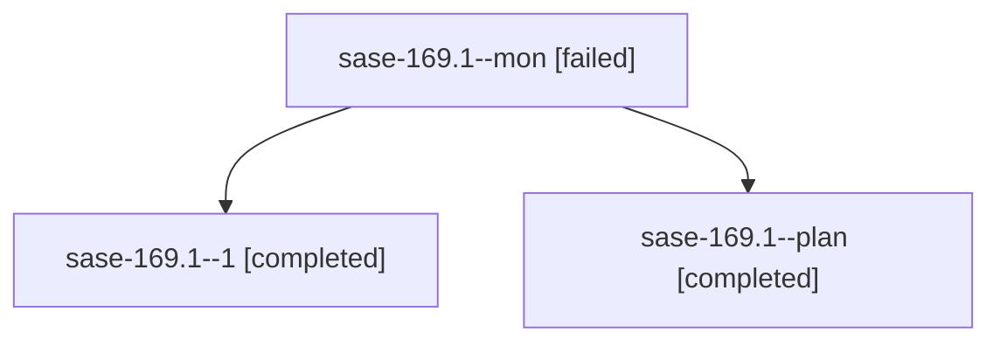

# Family: sase-169.1

[Agent Hoods](../README.md) / [bbugyi200](../users/bbugyi200/README.md) / [apollo](../users/bbugyi200/machines/apollo/README.md) / [sase-169](../users/bbugyi200/machines/apollo/hoods/sase-169/README.md) / sase-169.1

Owner: `bbugyi200.apollo` · Hood: `sase-169` · Members: 3 · Bead: [sase-169.1](https://github.com/sase-org/sase--beads/blob/main/pages/sase-169/sase-169.1.md)

## Lineage

The diagram is an optional enhancement; the ordered table below contains the same lineage in accessible text.

| Role | Agent | State | Model / provider | Timing | Commits | Prompt | Chat |
|---|---|---|---|---|---:|---|---|
| mon | sase-169.1--mon | failed | muse-spark-1.3-contributor / muse | 2026-09-22T14:38:24.025851+00:00 → 2026-09-22T14:43:15.702222+00:00 | 0 | — | [Chat](../agents/bbugyi200.apollo.sase-169.1--mon/chat.md) |
| 1 | sase-169.1--1 | completed | muse-spark-1.3-contributor / muse | 2026-09-22T14:43:15.209497+00:00 → 2026-09-22T14:57:55.185800+00:00 | [1](../agents/bbugyi200.apollo.sase-169.1--1/README.md#commits) | [Prompt](../agents/bbugyi200.apollo.sase-169.1--1/prompt.md) | [Chat](../agents/bbugyi200.apollo.sase-169.1--1/chat.md) |
| plan | sase-169.1--plan | completed | muse-spark-1.3-contributor / muse | 2026-09-22T14:19:40.820438+00:00 → 2026-09-22T14:38:51.718732+00:00 | 0 | [Prompt](../agents/bbugyi200.apollo.sase-169.1--plan/prompt.md) | [Chat](../agents/bbugyi200.apollo.sase-169.1--plan/chat.md) |

## Commits

| Role | Repo | Commit | Subject | Committed |
|---|---|---|---|---|
| 1 | sase | [`7c763a2`](https://github.com/sase-org/sase/commit/7c763a2e7b0173c2ffdd8f17d79c8f9f7a96d473) | test(visual): ignore non-visual deselection in capture inventory | 2026-09-22 10:54:16 EDT |

## Neighbors

| Agent | Relation | State |
|---|---|---|
| [sase-169.2](../agents/bbugyi200.apollo.sase-169.2/README.md) | sase-169 hood | completed |
| [sase-169.3](bbugyi200.apollo.sase-169.3.md) (family · 9) | sase-169 hood | completed 5, failed 4 |
| [sase-169.4](../agents/bbugyi200.apollo.sase-169.4/README.md) | sase-169 hood | completed |
| [sase-169.5](bbugyi200.apollo.sase-169.5.md) (family · 3) | sase-169 hood | completed 2, failed 1 |
| [sase-169.land](bbugyi200.apollo.sase-169.land.md) (family · 3) | sase-169 hood | active 2, failed 1 |
