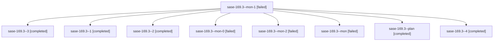

# Family: sase-169.3

[Agent Hoods](../README.md) / [bbugyi200](../users/bbugyi200/README.md) / [apollo](../users/bbugyi200/machines/apollo/README.md) / [sase-169](../users/bbugyi200/machines/apollo/hoods/sase-169/README.md) / sase-169.3

Owner: `bbugyi200.apollo` · Hood: `sase-169` · Members: 9 · Bead: [sase-169.3](https://github.com/sase-org/sase--beads/blob/main/pages/sase-169/sase-169.3.md)

## Lineage

The diagram is an optional enhancement; the ordered table below contains the same lineage in accessible text.

| Role | Agent | State | Model / provider | Timing | Commits | Prompt | Chat |
|---|---|---|---|---|---:|---|---|
| mon-1 | sase-169.3--mon-1 | failed | muse-spark-1.3-contributor / muse | 2026-09-22T17:26:51.348990+00:00 → 2026-09-22T17:39:40.333037+00:00 | 0 | — | [Chat](../agents/bbugyi200.apollo.sase-169.3--mon-1/chat.md) |
| 3 | sase-169.3--3 | completed | muse-spark-1.3-contributor / muse | 2026-09-22T17:39:39.938892+00:00 → 2026-09-22T17:41:43.316351+00:00 | 0 | [Prompt](../agents/bbugyi200.apollo.sase-169.3--3/prompt.md) | [Chat](../agents/bbugyi200.apollo.sase-169.3--3/chat.md) |
| 1 | sase-169.3--1 | completed | muse-spark-1.3-contributor / muse | 2026-09-22T17:12:34.345641+00:00 → 2026-09-22T17:14:14.985995+00:00 | 0 | [Prompt](../agents/bbugyi200.apollo.sase-169.3--1/prompt.md) | [Chat](../agents/bbugyi200.apollo.sase-169.3--1/chat.md) |
| 2 | sase-169.3--2 | completed | muse-spark-1.3-contributor / muse | 2026-09-22T17:26:13.635342+00:00 → 2026-09-22T17:28:03.559624+00:00 | 0 | [Prompt](../agents/bbugyi200.apollo.sase-169.3--2/prompt.md) | [Chat](../agents/bbugyi200.apollo.sase-169.3--2/chat.md) |
| mon-0 | sase-169.3--mon-0 | failed | muse-spark-1.3-contributor / muse | 2026-09-22T17:13:21.086356+00:00 → 2026-09-22T17:26:14.028633+00:00 | 0 | — | [Chat](../agents/bbugyi200.apollo.sase-169.3--mon-0/chat.md) |
| mon-2 | sase-169.3--mon-2 | failed | muse-spark-1.3-contributor / muse | 2026-09-22T17:40:02.937229+00:00 → 2026-09-22T17:52:22.278912+00:00 | 0 | — | [Chat](../agents/bbugyi200.apollo.sase-169.3--mon-2/chat.md) |
| mon | sase-169.3--mon | failed | muse-spark-1.3-contributor / muse | 2026-09-22T17:00:04.103526+00:00 → 2026-09-22T17:12:34.503376+00:00 | 0 | — | [Chat](../agents/bbugyi200.apollo.sase-169.3--mon/chat.md) |
| plan | sase-169.3--plan | completed | muse-spark-1.3-contributor / muse | 2026-09-22T16:20:11.019279+00:00 → 2026-09-22T17:00:38.225010+00:00 | 0 | [Prompt](../agents/bbugyi200.apollo.sase-169.3--plan/prompt.md) | [Chat](../agents/bbugyi200.apollo.sase-169.3--plan/chat.md) |
| 4 | sase-169.3--4 | completed | muse-spark-1.3-contributor / muse | 2026-09-22T17:52:21.823126+00:00 → 2026-09-22T18:04:27.584075+00:00 | [1](../agents/bbugyi200.apollo.sase-169.3--4/README.md#commits) | [Prompt](../agents/bbugyi200.apollo.sase-169.3--4/prompt.md) | [Chat](../agents/bbugyi200.apollo.sase-169.3--4/chat.md) |

## Commits

| Role | Repo | Commit | Subject | Committed |
|---|---|---|---|---|
| 4 | sase | [`716291a`](https://github.com/sase-org/sase/commit/716291a9fdb3601c10c9519a77e53b760f2bc1b6) | feat(screenshots): per-golden agreement voting over bounded serial re-verification | 2026-09-22 14:02:26 EDT |

## Neighbors

| Agent | Relation | State |
|---|---|---|
| [sase-169.1](bbugyi200.apollo.sase-169.1.md) (family · 3) | sase-169 hood | completed 2, failed 1 |
| [sase-169.2](../agents/bbugyi200.apollo.sase-169.2/README.md) | sase-169 hood | completed |
| [sase-169.4](../agents/bbugyi200.apollo.sase-169.4/README.md) | sase-169 hood | completed |
| [sase-169.5](bbugyi200.apollo.sase-169.5.md) (family · 3) | sase-169 hood | active 1, completed 1, failed 1 |
| [sase-169.land](../agents/bbugyi200.apollo.sase-169.land/README.md) | sase-169 hood | waiting |
