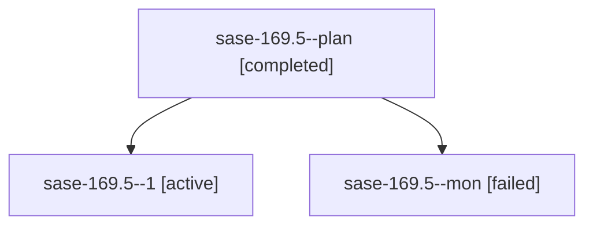

# Family: sase-169.5

[Agent Hoods](../README.md) / [bbugyi200](../users/bbugyi200/README.md) / [apollo](../users/bbugyi200/machines/apollo/README.md) / [sase-169](../users/bbugyi200/machines/apollo/hoods/sase-169/README.md) / sase-169.5

Owner: `bbugyi200.apollo` · Hood: `sase-169` · Members: 3 · Bead: [sase-169.5](https://github.com/sase-org/sase--beads/blob/main/pages/sase-169/sase-169.5.md)

## Lineage

The diagram is an optional enhancement; the ordered table below contains the same lineage in accessible text.

| Role | Agent | State | Model / provider | Timing | Commits | Prompt | Chat |
|---|---|---|---|---|---:|---|---|
| plan | sase-169.5--plan | completed | muse-spark-1.3-contributor / muse | 2026-09-22T22:56:58.470486+00:00 → 2026-09-23T00:06:36.840813+00:00 | 0 | [Prompt](../agents/bbugyi200.apollo.sase-169.5--plan/prompt.md) | [Chat](../agents/bbugyi200.apollo.sase-169.5--plan/chat.md) |
| 1 | sase-169.5--1 | active | muse-spark-1.3-contributor / muse | 2026-09-23T00:39:56.521023+00:00 | [1](../agents/bbugyi200.apollo.sase-169.5--1/README.md#commits) | [Prompt](../agents/bbugyi200.apollo.sase-169.5--1/prompt.md) | — |
| mon | sase-169.5--mon | failed | muse-spark-1.3-contributor / muse | 2026-09-23T00:06:10.108863+00:00 → 2026-09-23T00:39:56.554253+00:00 | 0 | — | [Chat](../agents/bbugyi200.apollo.sase-169.5--mon/chat.md) |

## Commits

| Role | Repo | Commit | Subject | Committed |
|---|---|---|---|---|
| 1 | sase | [`4be75a3`](https://github.com/sase-org/sase/commit/4be75a3d417deeecd69931a79b9a179c6247dc59) | docs(visual): document fix-tui-screenshots partial-success contract | 2026-09-22 20:44:38 EDT |

## Neighbors

| Agent | Relation | State |
|---|---|---|
| [sase-169.1](bbugyi200.apollo.sase-169.1.md) (family · 3) | sase-169 hood | completed 2, failed 1 |
| [sase-169.2](../agents/bbugyi200.apollo.sase-169.2/README.md) | sase-169 hood | completed |
| [sase-169.3](bbugyi200.apollo.sase-169.3.md) (family · 9) | sase-169 hood | completed 5, failed 4 |
| [sase-169.4](../agents/bbugyi200.apollo.sase-169.4/README.md) | sase-169 hood | completed |
| [sase-169.land](../agents/bbugyi200.apollo.sase-169.land/README.md) | sase-169 hood | waiting |
