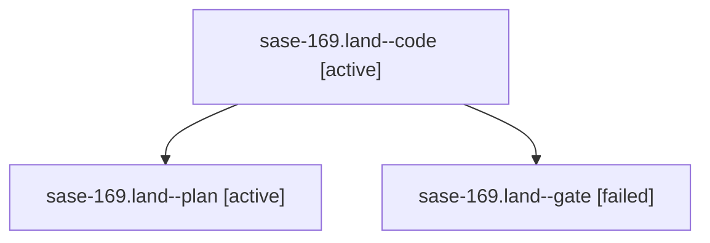

# Family: sase-169.land

[Agent Hoods](../README.md) / [bbugyi200](../users/bbugyi200/README.md) / [apollo](../users/bbugyi200/machines/apollo/README.md) / [sase-169](../users/bbugyi200/machines/apollo/hoods/sase-169/README.md) / sase-169.land

Owner: `bbugyi200.apollo` · Hood: `sase-169` · Members: 3 · Bead: [sase-169](https://github.com/sase-org/sase--beads/blob/main/pages/sase-169/README.md)

## Lineage

The diagram is an optional enhancement; the ordered table below contains the same lineage in accessible text.

| Role | Agent | State | Model / provider | Timing | Commits | Prompt | Chat |
|---|---|---|---|---|---:|---|---|
| code | sase-169.land--code | active | muse-spark-1.3-contributor / muse | 2026-09-23T01:35:59.628117+00:00 | [1](../agents/bbugyi200.apollo.sase-169.land--code/README.md#commits) | — | — |
| plan | sase-169.land--plan | active | opus / claude | 2026-09-23T00:46:50.619433+00:00 | 0 | [Prompt](../agents/bbugyi200.apollo.sase-169.land--plan/prompt.md) | [Chat](../agents/bbugyi200.apollo.sase-169.land--plan/chat.md) |
| gate | sase-169.land--gate | failed | opus / claude | 2026-09-23T01:35:25.398183+00:00 → 2026-09-23T01:35:37.154558+00:00 | 0 | — | [Chat](../agents/bbugyi200.apollo.sase-169.land--gate/chat.md) |

## Commits

| Role | Repo | Commit | Subject | Committed |
|---|---|---|---|---|
| code | sase | [`44cc2b7`](https://github.com/sase-org/sase/commit/44cc2b74b6c38ce4741d2d1a4822d11bdd0ce3db) | fix(visual): close sase-169 landing gaps in fix-tui-screenshots update mode | 2026-09-22 21:53:15 EDT |

## Neighbors

| Agent | Relation | State |
|---|---|---|
| [sase-169.1](bbugyi200.apollo.sase-169.1.md) (family · 3) | sase-169 hood | completed 2, failed 1 |
| [sase-169.2](../agents/bbugyi200.apollo.sase-169.2/README.md) | sase-169 hood | completed |
| [sase-169.3](bbugyi200.apollo.sase-169.3.md) (family · 9) | sase-169 hood | completed 5, failed 4 |
| [sase-169.4](../agents/bbugyi200.apollo.sase-169.4/README.md) | sase-169 hood | completed |
| [sase-169.5](bbugyi200.apollo.sase-169.5.md) (family · 3) | sase-169 hood | completed 2, failed 1 |
