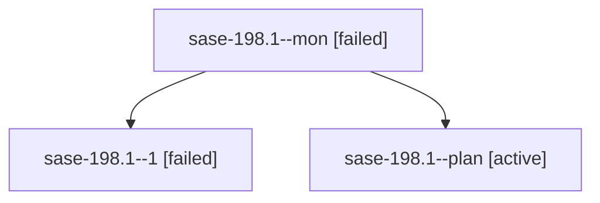

# Family: sase-198.1

[Agent Hoods](../README.md) / [bbugyi200](../users/bbugyi200/README.md) / [apollo](../users/bbugyi200/machines/apollo/README.md) / [sase-198](../users/bbugyi200/machines/apollo/hoods/sase-198/README.md) / sase-198.1

Owner: `bbugyi200.apollo` · Hood: `sase-198` · Members: 3 · Bead: [sase-198.1](https://github.com/sase-org/sase--beads/blob/main/pages/sase-198/sase-198.1.md)

## Lineage

The diagram is an optional enhancement; the ordered table below contains the same lineage in accessible text.

| Role | Agent | State | Model / provider | Timing | Commits | Prompt | Chat |
|---|---|---|---|---|---:|---|---|
| mon | sase-198.1--mon | failed | gpt-5.6-terra / codex | 2026-09-25T14:04:21.200532+00:00 → 2026-09-25T14:49:45.598304+00:00 | 0 | — | [Chat](../agents/bbugyi200.apollo.sase-198.1--mon/chat.md) |
| 1 | sase-198.1--1 | failed | gpt-5.6-terra / codex | 2026-09-25T14:49:45.113472+00:00 → 2026-09-25T15:26:25.571385+00:00 | 0 | [Prompt](../agents/bbugyi200.apollo.sase-198.1--1/prompt.md) | — |
| plan | sase-198.1--plan | active | gpt-5.6-terra / codex | 2026-09-25T13:49:49.352634+00:00 | 0 | [Prompt](../agents/bbugyi200.apollo.sase-198.1--plan/prompt.md) | [Chat](../agents/bbugyi200.apollo.sase-198.1--plan/chat.md) |

## Neighbors

| Agent | Relation | State |
|---|---|---|
| [sase-198.2](bbugyi200.apollo.sase-198.2.md) (family · 4) | sase-198 hood | active 1, completed 1, failed 2 |
| [sase-198.3](bbugyi200.apollo.sase-198.3.md) (family · 3) | sase-198 hood | completed 2, failed 1 |
| [sase-198.land](../agents/bbugyi200.apollo.sase-198.land/README.md) | sase-198 hood | active |
