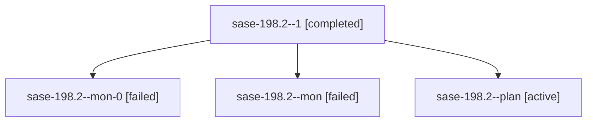

# Family: sase-198.2

[Agent Hoods](../README.md) / [bbugyi200](../users/bbugyi200/README.md) / [apollo](../users/bbugyi200/machines/apollo/README.md) / [sase-198](../users/bbugyi200/machines/apollo/hoods/sase-198/README.md) / sase-198.2

Owner: `bbugyi200.apollo` · Hood: `sase-198` · Members: 4 · Bead: [sase-198.2](https://github.com/sase-org/sase--beads/blob/main/pages/sase-198/sase-198.2.md)

## Lineage

The diagram is an optional enhancement; the ordered table below contains the same lineage in accessible text.

| Role | Agent | State | Model / provider | Timing | Commits | Prompt | Chat |
|---|---|---|---|---|---:|---|---|
| 1 | sase-198.2--1 | completed | grok-4.6 / grok | 2026-09-25T14:53:02.899476+00:00 → 2026-09-25T15:00:12.518218+00:00 | 0 | [Prompt](../agents/bbugyi200.apollo.sase-198.2--1/prompt.md) | [Chat](../agents/bbugyi200.apollo.sase-198.2--1/chat.md) |
| mon-0 | sase-198.2--mon-0 | failed | grok-4.6 / grok | 2026-09-25T14:59:44.563309+00:00 → 2026-09-25T15:30:13.592916+00:00 | 0 | — | [Chat](../agents/bbugyi200.apollo.sase-198.2--mon-0/chat.md) |
| mon | sase-198.2--mon | failed | grok-4.6 / grok | 2026-09-25T14:09:49.831011+00:00 → 2026-09-25T14:53:02.944382+00:00 | 0 | — | [Chat](../agents/bbugyi200.apollo.sase-198.2--mon/chat.md) |
| plan | sase-198.2--plan | active | grok-4.6 / grok | 2026-09-25T13:49:51.139982+00:00 | 0 | [Prompt](../agents/bbugyi200.apollo.sase-198.2--plan/prompt.md) | [Chat](../agents/bbugyi200.apollo.sase-198.2--plan/chat.md) |

## Neighbors

| Agent | Relation | State |
|---|---|---|
| [sase-198.1](bbugyi200.apollo.sase-198.1.md) (family · 3) | sase-198 hood | active 1, failed 2 |
| [sase-198.3](bbugyi200.apollo.sase-198.3.md) (family · 3) | sase-198 hood | completed 2, failed 1 |
| [sase-198.land](../agents/bbugyi200.apollo.sase-198.land/README.md) | sase-198 hood | active |
