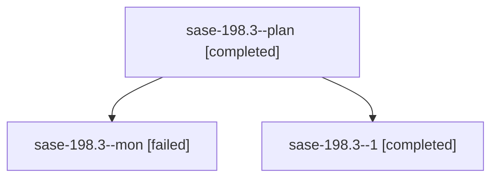

# Family: sase-198.3

[Agent Hoods](../README.md) / [bbugyi200](../users/bbugyi200/README.md) / [apollo](../users/bbugyi200/machines/apollo/README.md) / [sase-198](../users/bbugyi200/machines/apollo/hoods/sase-198/README.md) / sase-198.3

Owner: `bbugyi200.apollo` · Hood: `sase-198` · Members: 3 · Bead: [sase-198.3](https://github.com/sase-org/sase--beads/blob/main/pages/sase-198/sase-198.3.md)

## Lineage

The diagram is an optional enhancement; the ordered table below contains the same lineage in accessible text.

| Role | Agent | State | Model / provider | Timing | Commits | Prompt | Chat |
|---|---|---|---|---|---:|---|---|
| plan | sase-198.3--plan | completed | muse-spark-1.3-contributor / muse | 2026-09-25T16:24:13.261270+00:00 → 2026-09-25T16:55:01.897274+00:00 | 0 | [Prompt](../agents/bbugyi200.apollo.sase-198.3--plan/prompt.md) | [Chat](../agents/bbugyi200.apollo.sase-198.3--plan/chat.md) |
| mon | sase-198.3--mon | failed | muse-spark-1.3-contributor / muse | 2026-09-25T16:53:42.254470+00:00 → 2026-09-25T17:06:23.159386+00:00 | 0 | — | [Chat](../agents/bbugyi200.apollo.sase-198.3--mon/chat.md) |
| 1 | sase-198.3--1 | completed | muse-spark-1.3-contributor / muse | 2026-09-25T17:06:23.044796+00:00 → 2026-09-25T17:18:36.440434+00:00 | [1](../agents/bbugyi200.apollo.sase-198.3--1/README.md#commits) | [Prompt](../agents/bbugyi200.apollo.sase-198.3--1/prompt.md) | [Chat](../agents/bbugyi200.apollo.sase-198.3--1/chat.md) |

## Commits

| Role | Repo | Commit | Subject | Committed |
|---|---|---|---|---|
| 1 | sase | [`0607f7a`](https://github.com/sase-org/sase/commit/0607f7a083d80a96d3b1e9e0b5d6174417a6ce4e) | feat(queue): allow zero-load agents with %queue(weight=0) (sase-198.3) | 2026-09-25 13:12:21 EDT |

## Neighbors

| Agent | Relation | State |
|---|---|---|
| [sase-198.1](bbugyi200.apollo.sase-198.1.md) (family · 3) | sase-198 hood | active 1, failed 2 |
| [sase-198.2](bbugyi200.apollo.sase-198.2.md) (family · 4) | sase-198 hood | active 1, completed 1, failed 2 |
| [sase-198.land](../agents/bbugyi200.apollo.sase-198.land/README.md) | sase-198 hood | active |
