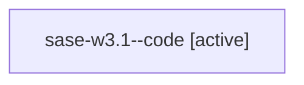

# Family: sase-w3.1

[Agent Hoods](../README.md) / [bbugyi200](../users/bbugyi200/README.md) / [apollo](../users/bbugyi200/machines/apollo/README.md) / [sase-w3](../users/bbugyi200/machines/apollo/hoods/sase-w3/README.md) / sase-w3.1

Owner: `bbugyi200.apollo` · Hood: `sase-w3` · Members: 1 · Bead: [sase-w3.1](https://github.com/sase-org/sase--beads/blob/main/pages/sase-w3/sase-w3.1.md)

## Lineage

The diagram is an optional enhancement; the ordered table below contains the same lineage in accessible text.

| Role | Agent | State | Model / provider | Timing | Commits | Prompt | Chat |
|---|---|---|---|---|---:|---|---|
| code | sase-w3.1--code | active | gpt-5.5 / codex | 2026-09-03T19:50:00.282813+00:00 | [1](../agents/bbugyi200.apollo.sase-w3.1--code/README.md#commits) | — | — |

## Commits

| Role | Repo | Commit | Subject | Committed |
|---|---|---|---|---|
| code | sase | [`8c3e7b6`](https://github.com/sase-org/sase/commit/8c3e7b6bffd9f518ec33ce1698f717b69a49a394) | feat: use core artifact row resolution | 2026-09-03 17:06:53 EDT |

## Neighbors

| Agent | Relation | State |
|---|---|---|
| [sase-w3.3](bbugyi200.apollo.sase-w3.3.md) (family · 3) | sase-w3 hood | completed 2, failed 1 |
| [sase-w3.4](bbugyi200.apollo.sase-w3.4.md) (family · 3) | sase-w3 hood | completed 2, failed 1 |
| [sase-w3.5](bbugyi200.apollo.sase-w3.5.md) (family · 3) | sase-w3 hood | active 1, completed 1, failed 1 |
| [sase-w3.6](../agents/bbugyi200.apollo.sase-w3.6/README.md) | sase-w3 hood | completed |
| [sase-w3.7](bbugyi200.apollo.sase-w3.7.md) (family · 3) | sase-w3 hood | completed 2, failed 1 |
| [sase-w3.land](../agents/bbugyi200.apollo.sase-w3.land/README.md) | sase-w3 hood | waiting |
