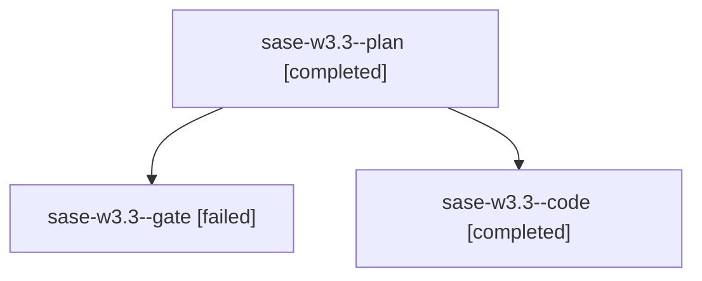

# Family: sase-w3.3

[Agent Hoods](../README.md) / [bbugyi200](../users/bbugyi200/README.md) / [apollo](../users/bbugyi200/machines/apollo/README.md) / [sase-w3](../users/bbugyi200/machines/apollo/hoods/sase-w3/README.md) / sase-w3.3

Owner: `bbugyi200.apollo` · Hood: `sase-w3` · Members: 3 · Bead: [sase-w3.3](https://github.com/sase-org/sase--beads/blob/main/pages/sase-w3/sase-w3.3.md)

## Lineage

The diagram is an optional enhancement; the ordered table below contains the same lineage in accessible text.

| Role | Agent | State | Model / provider | Timing | Commits | Prompt | Chat |
|---|---|---|---|---|---:|---|---|
| plan | sase-w3.3--plan | completed | gpt-5.6-sol / codex | 2026-09-04T10:51:19.110719+00:00 → 2026-09-04T12:07:52.494148+00:00 | 0 | [Prompt](../agents/bbugyi200.apollo.sase-w3.3--plan/prompt.md) | [Chat](../agents/bbugyi200.apollo.sase-w3.3--plan/chat.md) |
| gate | sase-w3.3--gate | failed | gpt-5.6-sol / codex | 2026-09-04T10:57:04.946435+00:00 → 2026-09-04T10:57:15.313950+00:00 | 0 | — | [Chat](../agents/bbugyi200.apollo.sase-w3.3--gate/chat.md) |
| code | sase-w3.3--code | completed | sonnet / claude | 2026-09-04T10:58:27.762636+00:00 → 2026-09-04T12:07:52.494148+00:00 | [1](../agents/bbugyi200.apollo.sase-w3.3--code/README.md#commits) | — | [Chat](../agents/bbugyi200.apollo.sase-w3.3--code/chat.md) |

## Commits

| Role | Repo | Commit | Subject | Committed |
|---|---|---|---|---|
| code | sase | [`82dc1e2`](https://github.com/sase-org/sase/commit/82dc1e2246875a66a8084b79d62baed734a2728a) | feat(ace): tri-state link-follow coordinator for artifact panes (sase-w3.3) | 2026-09-04 08:05:59 EDT |

## Neighbors

| Agent | Relation | State |
|---|---|---|
| [sase-w3.1](bbugyi200.apollo.sase-w3.1.md) (family · 1) | sase-w3 hood | active 1 |
| [sase-w3.4](bbugyi200.apollo.sase-w3.4.md) (family · 3) | sase-w3 hood | completed 2, failed 1 |
| [sase-w3.5](bbugyi200.apollo.sase-w3.5.md) (family · 3) | sase-w3 hood | active 1, completed 1, failed 1 |
| [sase-w3.6](../agents/bbugyi200.apollo.sase-w3.6/README.md) | sase-w3 hood | completed |
| [sase-w3.7](bbugyi200.apollo.sase-w3.7.md) (family · 3) | sase-w3 hood | completed 2, failed 1 |
| [sase-w3.land](../agents/bbugyi200.apollo.sase-w3.land/README.md) | sase-w3 hood | waiting |
