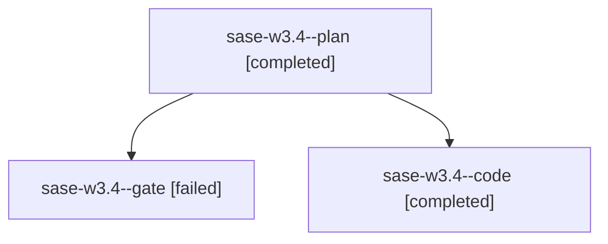

# Family: sase-w3.4

[Agent Hoods](../README.md) / [bbugyi200](../users/bbugyi200/README.md) / [apollo](../users/bbugyi200/machines/apollo/README.md) / [sase-w3](../users/bbugyi200/machines/apollo/hoods/sase-w3/README.md) / sase-w3.4

Owner: `bbugyi200.apollo` · Hood: `sase-w3` · Members: 3 · Bead: [sase-w3.4](https://github.com/sase-org/sase--beads/blob/main/pages/sase-w3/sase-w3.4.md)

## Lineage

The diagram is an optional enhancement; the ordered table below contains the same lineage in accessible text.

| Role | Agent | State | Model / provider | Timing | Commits | Prompt | Chat |
|---|---|---|---|---|---:|---|---|
| plan | sase-w3.4--plan | completed | opus / claude | 2026-09-04T13:15:20.322008+00:00 → 2026-09-04T15:00:28.665835+00:00 | 0 | [Prompt](../agents/bbugyi200.apollo.sase-w3.4--plan/prompt.md) | [Chat](../agents/bbugyi200.apollo.sase-w3.4--plan/chat.md) |
| gate | sase-w3.4--gate | failed | opus / claude | 2026-09-04T13:27:30.379688+00:00 → 2026-09-04T13:27:41.257166+00:00 | 0 | — | [Chat](../agents/bbugyi200.apollo.sase-w3.4--gate/chat.md) |
| code | sase-w3.4--code | completed | grok-4.6 / grok | 2026-09-04T13:29:24.343656+00:00 → 2026-09-04T15:00:28.665835+00:00 | [1](../agents/bbugyi200.apollo.sase-w3.4--code/README.md#commits) | — | [Chat](../agents/bbugyi200.apollo.sase-w3.4--code/chat.md) |

## Commits

| Role | Repo | Commit | Subject | Committed |
|---|---|---|---|---|
| code | sase | [`0f66320`](https://github.com/sase-org/sase/commit/0f66320dffd890e83975d016e0d18c8b2e4d5b39) | feat(tui): add host-owned artifact link reveal ladder | 2026-09-04 10:59:05 EDT |

## Neighbors

| Agent | Relation | State |
|---|---|---|
| [sase-w3.1](bbugyi200.apollo.sase-w3.1.md) (family · 1) | sase-w3 hood | active 1 |
| [sase-w3.3](bbugyi200.apollo.sase-w3.3.md) (family · 3) | sase-w3 hood | completed 2, failed 1 |
| [sase-w3.5](bbugyi200.apollo.sase-w3.5.md) (family · 3) | sase-w3 hood | active 1, completed 1, failed 1 |
| [sase-w3.6](../agents/bbugyi200.apollo.sase-w3.6/README.md) | sase-w3 hood | completed |
| [sase-w3.7](bbugyi200.apollo.sase-w3.7.md) (family · 3) | sase-w3 hood | completed 2, failed 1 |
| [sase-w3.land](../agents/bbugyi200.apollo.sase-w3.land/README.md) | sase-w3 hood | waiting |
