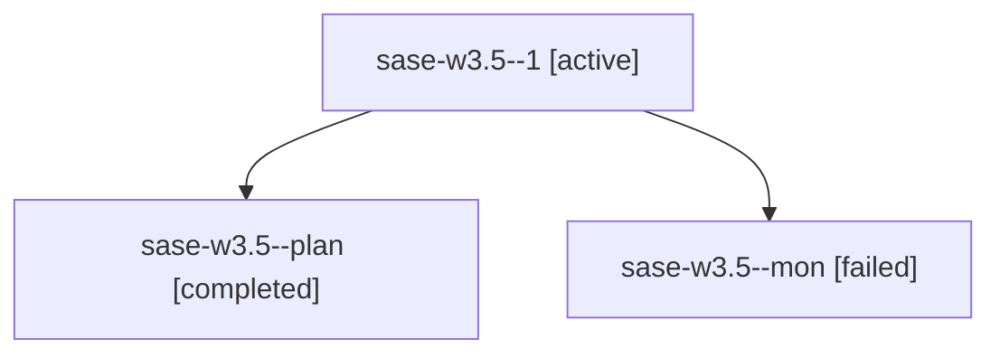

# Family: sase-w3.5

[Agent Hoods](../README.md) / [bbugyi200](../users/bbugyi200/README.md) / [apollo](../users/bbugyi200/machines/apollo/README.md) / [sase-w3](../users/bbugyi200/machines/apollo/hoods/sase-w3/README.md) / sase-w3.5

Owner: `bbugyi200.apollo` · Hood: `sase-w3` · Members: 3 · Bead: [sase-w3.5](https://github.com/sase-org/sase--beads/blob/main/pages/sase-w3/sase-w3.5.md)

## Lineage

The diagram is an optional enhancement; the ordered table below contains the same lineage in accessible text.

| Role | Agent | State | Model / provider | Timing | Commits | Prompt | Chat |
|---|---|---|---|---|---:|---|---|
| 1 | sase-w3.5--1 | active | grok-4.6 / grok | 2026-09-04T17:21:19.601701+00:00 | 0 | [Prompt](../agents/bbugyi200.apollo.sase-w3.5--1/prompt.md) | — |
| plan | sase-w3.5--plan | completed | grok-4.6 / grok | 2026-09-04T15:03:12.024412+00:00 → 2026-09-04T16:41:03.118675+00:00 | 0 | [Prompt](../agents/bbugyi200.apollo.sase-w3.5--plan/prompt.md) | [Chat](../agents/bbugyi200.apollo.sase-w3.5--plan/chat.md) |
| mon | sase-w3.5--mon | failed | grok-4.6 / grok | 2026-09-04T16:40:39.446699+00:00 → 2026-09-04T17:18:38.392930+00:00 | 0 | — | [Chat](../agents/bbugyi200.apollo.sase-w3.5--mon/chat.md) |

## Neighbors

| Agent | Relation | State |
|---|---|---|
| [sase-w3.1](bbugyi200.apollo.sase-w3.1.md) (family · 1) | sase-w3 hood | active 1 |
| [sase-w3.3](bbugyi200.apollo.sase-w3.3.md) (family · 3) | sase-w3 hood | completed 2, failed 1 |
| [sase-w3.4](bbugyi200.apollo.sase-w3.4.md) (family · 3) | sase-w3 hood | completed 2, failed 1 |
| [sase-w3.6](../agents/bbugyi200.apollo.sase-w3.6/README.md) | sase-w3 hood | completed |
| [sase-w3.7](bbugyi200.apollo.sase-w3.7.md) (family · 3) | sase-w3 hood | completed 2, failed 1 |
| [sase-w3.land](../agents/bbugyi200.apollo.sase-w3.land/README.md) | sase-w3 hood | waiting |
