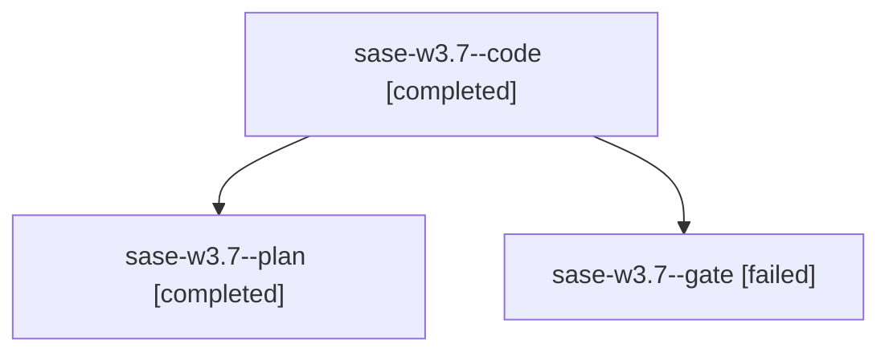

# Family: sase-w3.7

[Agent Hoods](../README.md) / [bbugyi200](../users/bbugyi200/README.md) / [apollo](../users/bbugyi200/machines/apollo/README.md) / [sase-w3](../users/bbugyi200/machines/apollo/hoods/sase-w3/README.md) / sase-w3.7

Owner: `bbugyi200.apollo` · Hood: `sase-w3` · Members: 3 · Bead: [sase-w3.7](https://github.com/sase-org/sase--beads/blob/main/pages/sase-w3/sase-w3.7.md)

## Lineage

The diagram is an optional enhancement; the ordered table below contains the same lineage in accessible text.

| Role | Agent | State | Model / provider | Timing | Commits | Prompt | Chat |
|---|---|---|---|---|---:|---|---|
| code | sase-w3.7--code | completed | sonnet / claude | 2026-09-04T15:14:42.028501+00:00 → 2026-09-04T16:13:51.367257+00:00 | [1](../agents/bbugyi200.apollo.sase-w3.7--code/README.md#commits) | — | [Chat](../agents/bbugyi200.apollo.sase-w3.7--code/chat.md) |
| plan | sase-w3.7--plan | completed | gpt-5.6-sol / codex | 2026-09-04T15:03:08.600031+00:00 → 2026-09-04T16:13:51.367257+00:00 | 0 | [Prompt](../agents/bbugyi200.apollo.sase-w3.7--plan/prompt.md) | [Chat](../agents/bbugyi200.apollo.sase-w3.7--plan/chat.md) |
| gate | sase-w3.7--gate | failed | gpt-5.6-sol / codex | 2026-09-04T15:11:43.299800+00:00 → 2026-09-04T15:11:53.838650+00:00 | 0 | — | [Chat](../agents/bbugyi200.apollo.sase-w3.7--gate/chat.md) |

## Commits

| Role | Repo | Commit | Subject | Committed |
|---|---|---|---|---|
| code | sase | [`ae196a3`](https://github.com/sase-org/sase/commit/ae196a367bf2f0a48533ce3af48e735c73ee44ff) | feat(ace): add targeted hydration for artifact link-follow panes | 2026-09-04 12:09:16 EDT |

## Neighbors

| Agent | Relation | State |
|---|---|---|
| [sase-w3.1](bbugyi200.apollo.sase-w3.1.md) (family · 1) | sase-w3 hood | active 1 |
| [sase-w3.3](bbugyi200.apollo.sase-w3.3.md) (family · 3) | sase-w3 hood | completed 2, failed 1 |
| [sase-w3.4](bbugyi200.apollo.sase-w3.4.md) (family · 3) | sase-w3 hood | completed 2, failed 1 |
| [sase-w3.5](bbugyi200.apollo.sase-w3.5.md) (family · 3) | sase-w3 hood | active 1, completed 1, failed 1 |
| [sase-w3.6](../agents/bbugyi200.apollo.sase-w3.6/README.md) | sase-w3 hood | completed |
| [sase-w3.land](../agents/bbugyi200.apollo.sase-w3.land/README.md) | sase-w3 hood | waiting |
