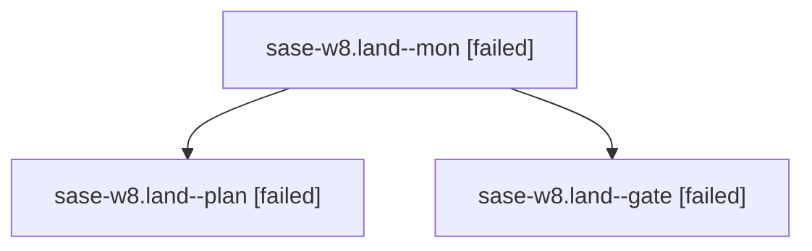

# Family: sase-w8.land

[Agent Hoods](../README.md) / [bbugyi200](../users/bbugyi200/README.md) / [apollo](../users/bbugyi200/machines/apollo/README.md) / [sase-w8](../users/bbugyi200/machines/apollo/hoods/sase-w8/README.md) / sase-w8.land

Owner: `bbugyi200.apollo` · Hood: `sase-w8` · Members: 3 · Bead: [sase-w8](https://github.com/sase-org/sase--beads/blob/main/pages/sase-w8/README.md)

## Lineage

The diagram is an optional enhancement; the ordered table below contains the same lineage in accessible text.

| Role | Agent | State | Model / provider | Timing | Commits | Prompt | Chat |
|---|---|---|---|---|---:|---|---|
| mon | sase-w8.land--mon | failed | gpt-5.6-sol / codex | 2026-09-04T16:28:18.460940+00:00 → 2026-09-04T16:40:44.261934+00:00 | 0 | — | [Chat](../agents/bbugyi200.apollo.sase-w8.land--mon/chat.md) |
| plan | sase-w8.land--plan | failed | gpt-5.6-sol / codex | 2026-09-04T15:28:50.347369+00:00 → 2026-09-04T16:28:31.480968+00:00 | 0 | [Prompt](../agents/bbugyi200.apollo.sase-w8.land--plan/prompt.md) | [Chat](../agents/bbugyi200.apollo.sase-w8.land--plan/chat.md) |
| gate | sase-w8.land--gate | failed | gpt-5.6-sol / codex | 2026-09-04T16:28:00.287651+00:00 → 2026-09-04T16:28:21.310351+00:00 | 0 | — | [Chat](../agents/bbugyi200.apollo.sase-w8.land--gate/chat.md) |

## Neighbors

| Agent | Relation | State |
|---|---|---|
| [sase-w8.4.1](../agents/bbugyi200.apollo.sase-w8.4.1/README.md) | sase-w8 hood | completed |
| [sase-w8.4.2](../agents/bbugyi200.apollo.sase-w8.4.2/README.md) | sase-w8 hood | completed |
| [sase-w8.4.land](../agents/bbugyi200.apollo.sase-w8.4.land/README.md) | sase-w8 hood | completed |
