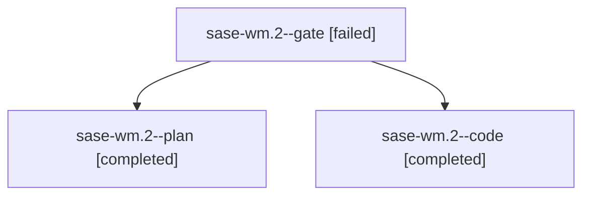

# Family: sase-wm.2

[Agent Hoods](../README.md) / [bbugyi200](../users/bbugyi200/README.md) / [apollo](../users/bbugyi200/machines/apollo/README.md) / [sase-wm](../users/bbugyi200/machines/apollo/hoods/sase-wm/README.md) / sase-wm.2

Owner: `bbugyi200.apollo` · Hood: `sase-wm` · Members: 3 · Bead: [sase-wm.2](https://github.com/sase-org/sase--beads/blob/main/pages/sase-wm/sase-wm.2.md)

## Lineage

The diagram is an optional enhancement; the ordered table below contains the same lineage in accessible text.

| Role | Agent | State | Model / provider | Timing | Commits | Prompt | Chat |
|---|---|---|---|---|---:|---|---|
| gate | sase-wm.2--gate | failed | opus / claude | 2026-09-04T22:17:02.549460+00:00 → 2026-09-04T22:17:20.333069+00:00 | 0 | — | [Chat](../agents/bbugyi200.apollo.sase-wm.2--gate/chat.md) |
| plan | sase-wm.2--plan | completed | opus / claude | 2026-09-04T22:04:02.432279+00:00 → 2026-09-05T02:13:17.351713+00:00 | 0 | [Prompt](../agents/bbugyi200.apollo.sase-wm.2--plan/prompt.md) | [Chat](../agents/bbugyi200.apollo.sase-wm.2--plan/chat.md) |
| code | sase-wm.2--code | completed | grok-4.6 / grok | 2026-09-04T22:18:40.756188+00:00 → 2026-09-05T02:13:17.351713+00:00 | 0 | — | [Chat](../agents/bbugyi200.apollo.sase-wm.2--code/chat.md) |

## Commits

| Role | Repo | Commit | Subject | Committed |
|---|---|---|---|---|
| — | sase | [`29ce9cd`](https://github.com/sase-org/sase/commit/29ce9cd8b202e6bfe6c1716ad773c25542b31ddc) | feat(ace): add Projects tab i/I init plan modal and streaming apply | 2026-09-04 22:10:36 EDT |

## Neighbors

| Agent | Relation | State |
|---|---|---|
| [sase-wm.1](../agents/bbugyi200.apollo.sase-wm.1/README.md) | sase-wm hood | completed |
| [sase-wm.3](../agents/bbugyi200.apollo.sase-wm.3/README.md) | sase-wm hood | completed |
| [sase-wm.4](../agents/bbugyi200.apollo.sase-wm.4/README.md) | sase-wm hood | completed |
| [sase-wm.5](bbugyi200.apollo.sase-wm.5.md) (family · 1) | sase-wm hood | completed 1 |
| [sase-wm.land](../agents/bbugyi200.apollo.sase-wm.land/README.md) | sase-wm hood | completed |
