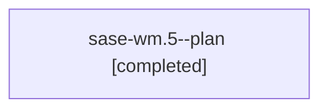

# Family: sase-wm.5

[Agent Hoods](../README.md) / [bbugyi200](../users/bbugyi200/README.md) / [apollo](../users/bbugyi200/machines/apollo/README.md) / [sase-wm](../users/bbugyi200/machines/apollo/hoods/sase-wm/README.md) / sase-wm.5

Owner: `bbugyi200.apollo` · Hood: `sase-wm` · Members: 1 · Bead: [sase-wm.5](https://github.com/sase-org/sase--beads/blob/main/pages/sase-wm/sase-wm.5.md)

## Lineage

The diagram is an optional enhancement; the ordered table below contains the same lineage in accessible text.

| Role | Agent | State | Model / provider | Timing | Commits | Prompt | Chat |
|---|---|---|---|---|---:|---|---|
| plan | sase-wm.5--plan | completed | gpt-5.5 / codex | 2026-09-05T03:29:43.456470+00:00 → 2026-09-05T05:50:38.637477+00:00 | [1](../agents/bbugyi200.apollo.sase-wm.5--plan/README.md#commits) | [Prompt](../agents/bbugyi200.apollo.sase-wm.5--plan/prompt.md) | [Chat](../agents/bbugyi200.apollo.sase-wm.5--plan/chat.md) |

## Commits

| Role | Repo | Commit | Subject | Committed |
|---|---|---|---|---|
| plan | sase | [`fab5ccc`](https://github.com/sase-org/sase/commit/fab5ccc370b842f7a9dfb27c1b0102c4737db849) | test(tui): verify projects init loop | 2026-09-05 01:47:48 EDT |

## Neighbors

| Agent | Relation | State |
|---|---|---|
| [sase-wm.1](../agents/bbugyi200.apollo.sase-wm.1/README.md) | sase-wm hood | completed |
| [sase-wm.2](bbugyi200.apollo.sase-wm.2.md) (family · 3) | sase-wm hood | completed 2, failed 1 |
| [sase-wm.3](../agents/bbugyi200.apollo.sase-wm.3/README.md) | sase-wm hood | completed |
| [sase-wm.4](../agents/bbugyi200.apollo.sase-wm.4/README.md) | sase-wm hood | completed |
| [sase-wm.land](../agents/bbugyi200.apollo.sase-wm.land/README.md) | sase-wm hood | completed |
