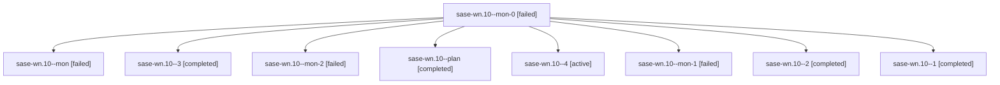

# Family: sase-wn.10

[Agent Hoods](../README.md) / [bbugyi200](../users/bbugyi200/README.md) / [apollo](../users/bbugyi200/machines/apollo/README.md) / [sase-wn](../users/bbugyi200/machines/apollo/hoods/sase-wn/README.md) / sase-wn.10

Owner: `bbugyi200.apollo` · Hood: `sase-wn` · Members: 9 · Bead: [sase-wn.10](https://github.com/sase-org/sase--beads/blob/main/pages/sase-wn/sase-wn.10.md)

## Lineage

The diagram is an optional enhancement; the ordered table below contains the same lineage in accessible text.

| Role | Agent | State | Model / provider | Timing | Commits | Prompt | Chat |
|---|---|---|---|---|---:|---|---|
| mon-0 | sase-wn.10--mon-0 | failed | grok-4.6 / grok | 2026-09-05T15:06:58.197776+00:00 → 2026-09-05T20:07:15.781417+00:00 | 0 | — | [Chat](../agents/bbugyi200.apollo.sase-wn.10--mon-0/chat.md) |
| mon | sase-wn.10--mon | failed | grok-4.6 / grok | 2026-09-05T12:28:37.523114+00:00 → 2026-09-05T14:34:53.272279+00:00 | 0 | — | [Chat](../agents/bbugyi200.apollo.sase-wn.10--mon/chat.md) |
| 3 | sase-wn.10--3 | completed | grok-4.6 / grok | 2026-09-05T20:40:43.024875+00:00 → 2026-09-05T20:54:38.519850+00:00 | 0 | [Prompt](../agents/bbugyi200.apollo.sase-wn.10--3/prompt.md) | [Chat](../agents/bbugyi200.apollo.sase-wn.10--3/chat.md) |
| mon-2 | sase-wn.10--mon-2 | failed | grok-4.6 / grok | 2026-09-05T20:54:19.027095+00:00 → 2026-09-05T21:25:57.618780+00:00 | 0 | — | [Chat](../agents/bbugyi200.apollo.sase-wn.10--mon-2/chat.md) |
| plan | sase-wn.10--plan | completed | grok-4.6 / grok | 2026-09-05T10:54:24.230364+00:00 → 2026-09-05T12:29:04.275355+00:00 | 0 | [Prompt](../agents/bbugyi200.apollo.sase-wn.10--plan/prompt.md) | [Chat](../agents/bbugyi200.apollo.sase-wn.10--plan/chat.md) |
| 4 | sase-wn.10--4 | active | grok-4.6 / grok | 2026-09-05T21:31:53.609273+00:00 | [1](../agents/bbugyi200.apollo.sase-wn.10--4/README.md#commits) | [Prompt](../agents/bbugyi200.apollo.sase-wn.10--4/prompt.md) | — |
| mon-1 | sase-wn.10--mon-1 | failed | grok-4.6 / grok | 2026-09-05T20:25:39.940448+00:00 → 2026-09-05T20:35:44.333476+00:00 | 0 | — | [Chat](../agents/bbugyi200.apollo.sase-wn.10--mon-1/chat.md) |
| 2 | sase-wn.10--2 | completed | grok-4.6 / grok | 2026-09-05T20:13:54.163457+00:00 → 2026-09-05T20:25:58.217524+00:00 | 0 | [Prompt](../agents/bbugyi200.apollo.sase-wn.10--2/prompt.md) | [Chat](../agents/bbugyi200.apollo.sase-wn.10--2/chat.md) |
| 1 | sase-wn.10--1 | completed | grok-4.6 / grok | 2026-09-05T14:40:32.071536+00:00 → 2026-09-05T15:07:17.866653+00:00 | 0 | [Prompt](../agents/bbugyi200.apollo.sase-wn.10--1/prompt.md) | [Chat](../agents/bbugyi200.apollo.sase-wn.10--1/chat.md) |

## Commits

| Role | Repo | Commit | Subject | Committed |
|---|---|---|---|---|
| 4 | sase | [`9ed0f11`](https://github.com/sase-org/sase/commit/9ed0f11b7c21c5da288833b44bfeb85ca12f16fc) | feat(axe): add idle-host perf counters, budgets, and status overlay | 2026-09-05 17:36:31 EDT |

## Neighbors

| Agent | Relation | State |
|---|---|---|
| [sase-wn.1](../agents/bbugyi200.apollo.sase-wn.1/README.md) | sase-wn hood | completed |
| [sase-wn.2](../agents/bbugyi200.apollo.sase-wn.2/README.md) | sase-wn hood | completed |
| [sase-wn.3](../agents/bbugyi200.apollo.sase-wn.3/README.md) | sase-wn hood | completed |
| [sase-wn.4](../agents/bbugyi200.apollo.sase-wn.4/README.md) | sase-wn hood | dismissed |
| [sase-wn.5](bbugyi200.apollo.sase-wn.5.md) (family · 5) | sase-wn hood | completed 3, failed 2 |
| [sase-wn.6](../agents/bbugyi200.apollo.sase-wn.6/README.md) | sase-wn hood | completed |
| [sase-wn.7](../agents/bbugyi200.apollo.sase-wn.7/README.md) | sase-wn hood | completed |
| [sase-wn.8](../agents/bbugyi200.apollo.sase-wn.8/README.md) | sase-wn hood | completed |
| [sase-wn.9](../agents/bbugyi200.apollo.sase-wn.9/README.md) | sase-wn hood | completed |
| [sase-wn.land](../agents/bbugyi200.apollo.sase-wn.land/README.md) | sase-wn hood | waiting |
