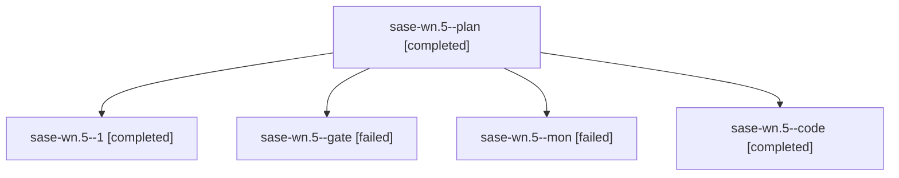

# Family: sase-wn.5

[Agent Hoods](../README.md) / [bbugyi200](../users/bbugyi200/README.md) / [apollo](../users/bbugyi200/machines/apollo/README.md) / [sase-wn](../users/bbugyi200/machines/apollo/hoods/sase-wn/README.md) / sase-wn.5

Owner: `bbugyi200.apollo` · Hood: `sase-wn` · Members: 5 · Bead: [sase-wn.5](https://github.com/sase-org/sase--beads/blob/main/pages/sase-wn/sase-wn.5.md)

## Lineage

The diagram is an optional enhancement; the ordered table below contains the same lineage in accessible text.

| Role | Agent | State | Model / provider | Timing | Commits | Prompt | Chat |
|---|---|---|---|---|---:|---|---|
| plan | sase-wn.5--plan | completed | gpt-5.6-sol / codex | 2026-09-04T16:49:47.337899+00:00 → 2026-09-04T18:56:00.584594+00:00 | 0 | [Prompt](../agents/bbugyi200.apollo.sase-wn.5--plan/prompt.md) | [Chat](../agents/bbugyi200.apollo.sase-wn.5--plan/chat.md) |
| 1 | sase-wn.5--1 | completed | grok-4.6 / grok | 2026-09-04T19:44:14.977875+00:00 → 2026-09-05T00:56:09.062705+00:00 | 0 | [Prompt](../agents/bbugyi200.apollo.sase-wn.5--1/prompt.md) | [Chat](../agents/bbugyi200.apollo.sase-wn.5--1/chat.md) |
| gate | sase-wn.5--gate | failed | gpt-5.6-sol / codex | 2026-09-04T16:57:43.390152+00:00 → 2026-09-04T16:57:56.198563+00:00 | 0 | — | [Chat](../agents/bbugyi200.apollo.sase-wn.5--gate/chat.md) |
| mon | sase-wn.5--mon | failed | grok-4.6 / grok | 2026-09-04T18:55:08.158498+00:00 → 2026-09-04T19:42:51.159183+00:00 | 0 | — | [Chat](../agents/bbugyi200.apollo.sase-wn.5--mon/chat.md) |
| code | sase-wn.5--code | completed | grok-4.6 / grok | 2026-09-04T16:59:05.452234+00:00 → 2026-09-04T18:56:00.584594+00:00 | 0 | — | [Chat](../agents/bbugyi200.apollo.sase-wn.5--code/chat.md) |

## Commits

| Role | Repo | Commit | Subject | Committed |
|---|---|---|---|---|
| — | sase | [`2eb1335`](https://github.com/sase-org/sase/commit/2eb13350f991a84b340f4d6619334b9311bd7f9c) | feat(ace): gate auto-refresh on per-surface change tokens | 2026-09-04 20:53:28 EDT |

## Neighbors

| Agent | Relation | State |
|---|---|---|
| [sase-wn.1](../agents/bbugyi200.apollo.sase-wn.1/README.md) | sase-wn hood | completed |
| [sase-wn.10](bbugyi200.apollo.sase-wn.10.md) (family · 9) | sase-wn hood | active 1, completed 4, failed 4 |
| [sase-wn.2](../agents/bbugyi200.apollo.sase-wn.2/README.md) | sase-wn hood | completed |
| [sase-wn.3](../agents/bbugyi200.apollo.sase-wn.3/README.md) | sase-wn hood | completed |
| [sase-wn.4](../agents/bbugyi200.apollo.sase-wn.4/README.md) | sase-wn hood | dismissed |
| [sase-wn.6](../agents/bbugyi200.apollo.sase-wn.6/README.md) | sase-wn hood | completed |
| [sase-wn.7](../agents/bbugyi200.apollo.sase-wn.7/README.md) | sase-wn hood | completed |
| [sase-wn.8](../agents/bbugyi200.apollo.sase-wn.8/README.md) | sase-wn hood | completed |
| [sase-wn.9](../agents/bbugyi200.apollo.sase-wn.9/README.md) | sase-wn hood | completed |
| [sase-wn.land](../agents/bbugyi200.apollo.sase-wn.land/README.md) | sase-wn hood | waiting |
