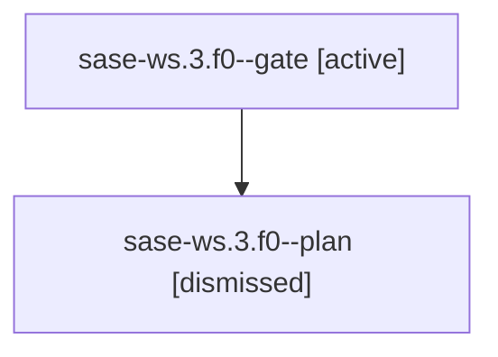

# Family: sase-ws.3.f0

[Agent Hoods](../README.md) / [bbugyi200](../users/bbugyi200/README.md) / [apollo](../users/bbugyi200/machines/apollo/README.md) / [sase-ws](../users/bbugyi200/machines/apollo/hoods/sase-ws/README.md) / sase-ws.3.f0

Owner: `bbugyi200.apollo` · Hood: `sase-ws` · Members: 2

## Lineage

The diagram is an optional enhancement; the ordered table below contains the same lineage in accessible text.

| Role | Agent | State | Model / provider | Timing | Commits | Prompt | Chat |
|---|---|---|---|---|---:|---|---|
| gate | sase-ws.3.f0--gate | active | claude-fable-5 / claude | 2026-09-05T11:16:19.575541+00:00 | 0 | — | — |
| plan | sase-ws.3.f0--plan | dismissed | claude-fable-5 / claude | 2026-09-05T06:54:15.426937 → 2026-09-05T07:16:34.061172 | 0 | [Prompt](../agents/bbugyi200.apollo.sase-ws.3.f0--plan/prompt.md) | [Chat](../agents/bbugyi200.apollo.sase-ws.3.f0--plan/chat.md) |

## Neighbors

| Agent | Relation | State |
|---|---|---|
| [sase-ws.3](../agents/bbugyi200.apollo.sase-ws.3/README.md) | ancestor | completed |
| [sase-ws.4](bbugyi200.apollo.sase-ws.4.md) (family · 3) | sase-ws hood | active 2, failed 1 |
| [sase-ws.5](../agents/bbugyi200.apollo.sase-ws.5/README.md) | sase-ws hood | waiting |
| [sase-ws.6](../agents/bbugyi200.apollo.sase-ws.6/README.md) | sase-ws hood | waiting |
| [sase-ws.land](../agents/bbugyi200.apollo.sase-ws.land/README.md) | sase-ws hood | waiting |
