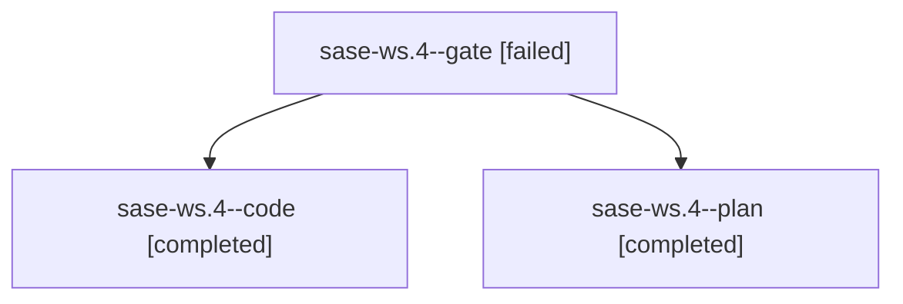

# Family: sase-ws.4

[Agent Hoods](../README.md) / [bbugyi200](../users/bbugyi200/README.md) / [apollo](../users/bbugyi200/machines/apollo/README.md) / [sase-ws](../users/bbugyi200/machines/apollo/hoods/sase-ws/README.md) / sase-ws.4

Owner: `bbugyi200.apollo` · Hood: `sase-ws` · Members: 3 · Bead: [sase-ws.4](https://github.com/sase-org/sase--beads/blob/main/pages/sase-ws/sase-ws.4.md)

## Lineage

The diagram is an optional enhancement; the ordered table below contains the same lineage in accessible text.

| Role | Agent | State | Model / provider | Timing | Commits | Prompt | Chat |
|---|---|---|---|---|---:|---|---|
| gate | sase-ws.4--gate | failed | gpt-5.6-sol / codex | 2026-09-05T15:41:38.636615+00:00 → 2026-09-05T15:41:51.264277+00:00 | 0 | — | [Chat](../agents/bbugyi200.apollo.sase-ws.4--gate/chat.md) |
| code | sase-ws.4--code | completed | gpt-5.5 / codex | 2026-09-05T15:47:18.242992+00:00 → 2026-09-05T17:48:23.716004+00:00 | [1](../agents/bbugyi200.apollo.sase-ws.4--code/README.md#commits) | — | [Chat](../agents/bbugyi200.apollo.sase-ws.4--code/chat.md) |
| plan | sase-ws.4--plan | completed | gpt-5.6-sol / codex | 2026-09-05T15:27:35.056964+00:00 → 2026-09-05T17:48:23.716004+00:00 | 0 | [Prompt](../agents/bbugyi200.apollo.sase-ws.4--plan/prompt.md) | [Chat](../agents/bbugyi200.apollo.sase-ws.4--plan/chat.md) |

## Commits

| Role | Repo | Commit | Subject | Committed |
|---|---|---|---|---|
| code | sase | [`b5b3a98`](https://github.com/sase-org/sase/commit/b5b3a984f2fbe16909aa75e8007d43c35ea36681) | refactor(agents-sync): delete import engine | 2026-09-05 13:46:14 EDT |

## Neighbors

| Agent | Relation | State |
|---|---|---|
| [sase-ws.3](../agents/bbugyi200.apollo.sase-ws.3/README.md) | sase-ws hood | completed |
| [sase-ws.3.f0](bbugyi200.apollo.sase-ws.3.f0.md) (family · 2) | sase-ws hood | active 1, dismissed 1 |
| [sase-ws.5](../agents/bbugyi200.apollo.sase-ws.5/README.md) | sase-ws hood | completed |
| [sase-ws.6](../agents/bbugyi200.apollo.sase-ws.6/README.md) | sase-ws hood | active |
| [sase-ws.land](../agents/bbugyi200.apollo.sase-ws.land/README.md) | sase-ws hood | waiting |
