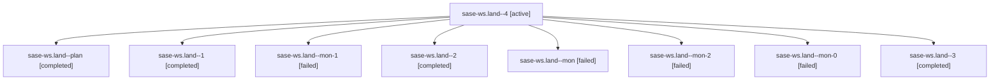

# Family: sase-ws.land

[Agent Hoods](../README.md) / [bbugyi200](../users/bbugyi200/README.md) / [apollo](../users/bbugyi200/machines/apollo/README.md) / [sase-ws](../users/bbugyi200/machines/apollo/hoods/sase-ws/README.md) / sase-ws.land

Owner: `bbugyi200.apollo` · Hood: `sase-ws` · Members: 9 · Bead: [sase-ws](https://github.com/sase-org/sase--beads/blob/main/pages/sase-ws/README.md)

## Lineage

The diagram is an optional enhancement; the ordered table below contains the same lineage in accessible text.

| Role | Agent | State | Model / provider | Timing | Commits | Prompt | Chat |
|---|---|---|---|---|---:|---|---|
| 4 | sase-ws.land--4 | active | claude-fable-5 / claude | 2026-09-06T04:15:46.418128+00:00 | [1](../agents/bbugyi200.apollo.sase-ws.land--4/README.md#commits) | [Prompt](../agents/bbugyi200.apollo.sase-ws.land--4/prompt.md) | — |
| plan | sase-ws.land--plan | completed | claude-fable-5 / claude | 2026-09-05T20:29:32.597340+00:00 → 2026-09-05T20:49:13.589662+00:00 | 0 | [Prompt](../agents/bbugyi200.apollo.sase-ws.land--plan/prompt.md) | [Chat](../agents/bbugyi200.apollo.sase-ws.land--plan/chat.md) |
| 1 | sase-ws.land--1 | completed | claude-fable-5 / claude | 2026-09-05T22:23:38.032130+00:00 → 2026-09-05T22:26:00.689473+00:00 | 0 | [Prompt](../agents/bbugyi200.apollo.sase-ws.land--1/prompt.md) | [Chat](../agents/bbugyi200.apollo.sase-ws.land--1/chat.md) |
| mon-1 | sase-ws.land--mon-1 | failed | claude-fable-5 / claude | 2026-09-06T00:15:27.654468+00:00 → 2026-09-06T02:05:22.526033+00:00 | 0 | — | [Chat](../agents/bbugyi200.apollo.sase-ws.land--mon-1/chat.md) |
| 2 | sase-ws.land--2 | completed | claude-fable-5 / claude | 2026-09-06T00:08:44.055936+00:00 → 2026-09-06T00:15:43.591353+00:00 | 0 | [Prompt](../agents/bbugyi200.apollo.sase-ws.land--2/prompt.md) | [Chat](../agents/bbugyi200.apollo.sase-ws.land--2/chat.md) |
| mon | sase-ws.land--mon | failed | claude-fable-5 / claude | 2026-09-05T20:48:59.162534+00:00 → 2026-09-05T22:19:13.583076+00:00 | 0 | — | [Chat](../agents/bbugyi200.apollo.sase-ws.land--mon/chat.md) |
| mon-2 | sase-ws.land--mon-2 | failed | claude-fable-5 / claude | 2026-09-06T02:20:01.866991+00:00 → 2026-09-06T04:10:48.073284+00:00 | 0 | — | [Chat](../agents/bbugyi200.apollo.sase-ws.land--mon-2/chat.md) |
| mon-0 | sase-ws.land--mon-0 | failed | claude-fable-5 / claude | 2026-09-05T22:25:47.203988+00:00 → 2026-09-06T00:04:48.072938+00:00 | 0 | — | [Chat](../agents/bbugyi200.apollo.sase-ws.land--mon-0/chat.md) |
| 3 | sase-ws.land--3 | completed | claude-fable-5 / claude | 2026-09-06T02:09:09.108455+00:00 → 2026-09-06T02:20:20.556865+00:00 | 0 | [Prompt](../agents/bbugyi200.apollo.sase-ws.land--3/prompt.md) | [Chat](../agents/bbugyi200.apollo.sase-ws.land--3/chat.md) |

## Commits

| Role | Repo | Commit | Subject | Committed |
|---|---|---|---|---|
| 4 | sase | [`d6705a1`](https://github.com/sase-org/sase/commit/d6705a16bdbc6c8dd44f29154044d8384e47335f) | test(sase-ws): fix landing-gate leak poisonings and models-panel layout flake | 2026-09-06 00:34:08 EDT |

## Neighbors

| Agent | Relation | State |
|---|---|---|
| [sase-ws.3](../agents/bbugyi200.apollo.sase-ws.3/README.md) | sase-ws hood | completed |
| [sase-ws.3.f0](bbugyi200.apollo.sase-ws.3.f0.md) (family · 2) | sase-ws hood | active 1, dismissed 1 |
| [sase-ws.4](bbugyi200.apollo.sase-ws.4.md) (family · 3) | sase-ws hood | completed 2, failed 1 |
| [sase-ws.5](../agents/bbugyi200.apollo.sase-ws.5/README.md) | sase-ws hood | completed |
| [sase-ws.6](../agents/bbugyi200.apollo.sase-ws.6/README.md) | sase-ws hood | completed |
