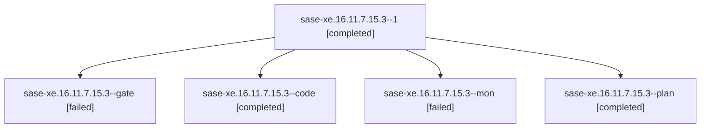

# Family: sase-xe.16.11.7.15.3

[Agent Hoods](../README.md) / [bbugyi200](../users/bbugyi200/README.md) / [apollo](../users/bbugyi200/machines/apollo/README.md) / [sase-xe](../users/bbugyi200/machines/apollo/hoods/sase-xe/README.md) / sase-xe.16.11.7.15.3

Owner: `bbugyi200.apollo` · Hood: `sase-xe` · Members: 5 · Bead: [sase-xe.16.11.7.15.3](https://github.com/sase-org/sase--beads/blob/main/pages/sase-xe/sase-xe.16.11.7.15.3.md)

## Lineage

The diagram is an optional enhancement; the ordered table below contains the same lineage in accessible text.

| Role | Agent | State | Model / provider | Timing | Commits | Prompt | Chat |
|---|---|---|---|---|---:|---|---|
| 1 | sase-xe.16.11.7.15.3--1 | completed | gpt-5.5 / codex | 2026-09-13T23:24:13.869894+00:00 → 2026-09-14T00:15:45.843705+00:00 | 0 | [Prompt](../agents/bbugyi200.apollo.sase-xe.16.11.7.15.3--1/prompt.md) | [Chat](../agents/bbugyi200.apollo.sase-xe.16.11.7.15.3--1/chat.md) |
| gate | sase-xe.16.11.7.15.3--gate | failed | opus / claude | 2026-09-13T22:53:46.933046+00:00 → 2026-09-13T22:53:57.863894+00:00 | 0 | — | [Chat](../agents/bbugyi200.apollo.sase-xe.16.11.7.15.3--gate/chat.md) |
| code | sase-xe.16.11.7.15.3--code | completed | gpt-5.5 / codex | 2026-09-13T22:54:06.076900+00:00 → 2026-09-13T23:24:00.021173+00:00 | 0 | — | [Chat](../agents/bbugyi200.apollo.sase-xe.16.11.7.15.3--code/chat.md) |
| mon | sase-xe.16.11.7.15.3--mon | failed | gpt-5.5 / codex | 2026-09-13T23:23:41.171650+00:00 → 2026-09-13T23:24:14.022153+00:00 | 0 | — | [Chat](../agents/bbugyi200.apollo.sase-xe.16.11.7.15.3--mon/chat.md) |
| plan | sase-xe.16.11.7.15.3--plan | completed | opus / claude | 2026-09-13T22:40:25.652229+00:00 → 2026-09-13T23:24:00.021173+00:00 | 0 | [Prompt](../agents/bbugyi200.apollo.sase-xe.16.11.7.15.3--plan/prompt.md) | [Chat](../agents/bbugyi200.apollo.sase-xe.16.11.7.15.3--plan/chat.md) |

## Neighbors

| Agent | Relation | State |
|---|---|---|
| [sase-xe.16.11.7.15.1](../agents/bbugyi200.apollo.sase-xe.16.11.7.15.1/README.md) | sase-xe.16.11.7.15 hood | completed |
| [sase-xe.16.11.7.15.2](bbugyi200.apollo.sase-xe.16.11.7.15.2.md) (family · 3) | sase-xe.16.11.7.15 hood | completed 2, failed 1 |
| [sase-xe.16.11.7.15.4](bbugyi200.apollo.sase-xe.16.11.7.15.4.md) (family · 9) | sase-xe.16.11.7.15 hood | completed 5, failed 4 |
| [sase-xe.16.11.7.15.4](../agents/bbugyi200.apollo.sase-xe.16.11.7.15.4/README.md) | sase-xe.16.11.7.15 hood | completed |
| [sase-xe.16.11.7.15.5](bbugyi200.apollo.sase-xe.16.11.7.15.5.md) (family · 3) | sase-xe.16.11.7.15 hood | completed 2, failed 1 |
| [sase-xe.16.11.7.15.6](../agents/bbugyi200.apollo.sase-xe.16.11.7.15.6/README.md) | sase-xe.16.11.7.15 hood | active |
| [sase-xe.16.11.7.15.7](../agents/bbugyi200.apollo.sase-xe.16.11.7.15.7/README.md) | sase-xe.16.11.7.15 hood | waiting |
| [sase-xe.16.11.7.15.land](../agents/bbugyi200.apollo.sase-xe.16.11.7.15.land/README.md) | sase-xe.16.11.7.15 hood | waiting |
