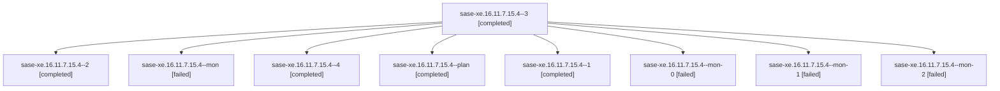

# Family: sase-xe.16.11.7.15.4

[Agent Hoods](../README.md) / [bbugyi200](../users/bbugyi200/README.md) / [apollo](../users/bbugyi200/machines/apollo/README.md) / [sase-xe](../users/bbugyi200/machines/apollo/hoods/sase-xe/README.md) / sase-xe.16.11.7.15.4

Owner: `bbugyi200.apollo` · Hood: `sase-xe` · Members: 9 · Bead: [sase-xe.16.11.7.15.4](https://github.com/sase-org/sase--beads/blob/main/pages/sase-xe/sase-xe.16.11.7.15.4.md)

## Lineage

The diagram is an optional enhancement; the ordered table below contains the same lineage in accessible text.

| Role | Agent | State | Model / provider | Timing | Commits | Prompt | Chat |
|---|---|---|---|---|---:|---|---|
| 3 | sase-xe.16.11.7.15.4--3 | completed | sonnet / claude | 2026-09-14T12:07:41.527521+00:00 → 2026-09-14T12:09:58.619113+00:00 | 0 | [Prompt](../agents/bbugyi200.apollo.sase-xe.16.11.7.15.4--3/prompt.md) | [Chat](../agents/bbugyi200.apollo.sase-xe.16.11.7.15.4--3/chat.md) |
| 2 | sase-xe.16.11.7.15.4--2 | completed | sonnet / claude | 2026-09-14T11:54:19.264046+00:00 → 2026-09-14T11:55:38.713526+00:00 | 0 | [Prompt](../agents/bbugyi200.apollo.sase-xe.16.11.7.15.4--2/prompt.md) | [Chat](../agents/bbugyi200.apollo.sase-xe.16.11.7.15.4--2/chat.md) |
| mon | sase-xe.16.11.7.15.4--mon | failed | sonnet / claude | 2026-09-14T11:21:53.098512+00:00 → 2026-09-14T11:25:02.334965+00:00 | 0 | — | [Chat](../agents/bbugyi200.apollo.sase-xe.16.11.7.15.4--mon/chat.md) |
| 4 | sase-xe.16.11.7.15.4--4 | completed | sonnet / claude | 2026-09-14T12:25:29.956208+00:00 → 2026-09-14T12:39:09.773687+00:00 | [2](../agents/bbugyi200.apollo.sase-xe.16.11.7.15.4--4/README.md#commits) | [Prompt](../agents/bbugyi200.apollo.sase-xe.16.11.7.15.4--4/prompt.md) | [Chat](../agents/bbugyi200.apollo.sase-xe.16.11.7.15.4--4/chat.md) |
| plan | sase-xe.16.11.7.15.4--plan | completed | sonnet / claude | 2026-09-14T11:07:25.457637+00:00 → 2026-09-14T11:22:06.418780+00:00 | 0 | [Prompt](../agents/bbugyi200.apollo.sase-xe.16.11.7.15.4--plan/prompt.md) | [Chat](../agents/bbugyi200.apollo.sase-xe.16.11.7.15.4--plan/chat.md) |
| 1 | sase-xe.16.11.7.15.4--1 | completed | sonnet / claude | 2026-09-14T11:25:02.130376+00:00 → 2026-09-14T11:34:21.958538+00:00 | 0 | [Prompt](../agents/bbugyi200.apollo.sase-xe.16.11.7.15.4--1/prompt.md) | [Chat](../agents/bbugyi200.apollo.sase-xe.16.11.7.15.4--1/chat.md) |
| mon-0 | sase-xe.16.11.7.15.4--mon-0 | failed | sonnet / claude | 2026-09-14T11:34:02.501023+00:00 → 2026-09-14T11:54:19.438890+00:00 | 0 | — | [Chat](../agents/bbugyi200.apollo.sase-xe.16.11.7.15.4--mon-0/chat.md) |
| mon-1 | sase-xe.16.11.7.15.4--mon-1 | failed | sonnet / claude | 2026-09-14T11:55:19.215051+00:00 → 2026-09-14T12:07:41.731207+00:00 | 0 | — | [Chat](../agents/bbugyi200.apollo.sase-xe.16.11.7.15.4--mon-1/chat.md) |
| mon-2 | sase-xe.16.11.7.15.4--mon-2 | failed | sonnet / claude | 2026-09-14T12:09:24.098533+00:00 → 2026-09-14T12:25:30.206189+00:00 | 0 | — | [Chat](../agents/bbugyi200.apollo.sase-xe.16.11.7.15.4--mon-2/chat.md) |

## Commits

| Role | Repo | Commit | Subject | Committed |
|---|---|---|---|---|
| 4 | sase | [`7e922da`](https://github.com/sase-org/sase/commit/7e922da66631b2283ae2d31626abf3acaf4d4c59) | chore(core): ratchet sase-core-revision.txt to a35b18220fb3 | 2026-09-14 08:26:43 EDT |
| 4 | sase | [`d699f27`](https://github.com/sase-org/sase/commit/d699f2761a4da7ec0387ff1a10ee5e3cea0563f5) | fix(monitor): use absolute import for store module in store\_lane.py | 2026-09-14 08:32:09 EDT |

## Neighbors

| Agent | Relation | State |
|---|---|---|
| [sase-xe.16.11.7.15.1](../agents/bbugyi200.apollo.sase-xe.16.11.7.15.1/README.md) | sase-xe.16.11.7.15 hood | completed |
| [sase-xe.16.11.7.15.2](bbugyi200.apollo.sase-xe.16.11.7.15.2.md) (family · 3) | sase-xe.16.11.7.15 hood | completed 2, failed 1 |
| [sase-xe.16.11.7.15.3](bbugyi200.apollo.sase-xe.16.11.7.15.3.md) (family · 5) | sase-xe.16.11.7.15 hood | completed 3, failed 2 |
| [sase-xe.16.11.7.15.5](bbugyi200.apollo.sase-xe.16.11.7.15.5.md) (family · 3) | sase-xe.16.11.7.15 hood | active 1, completed 1, failed 1 |
| [sase-xe.16.11.7.15.6](../agents/bbugyi200.apollo.sase-xe.16.11.7.15.6/README.md) | sase-xe.16.11.7.15 hood | waiting |
| [sase-xe.16.11.7.15.7](../agents/bbugyi200.apollo.sase-xe.16.11.7.15.7/README.md) | sase-xe.16.11.7.15 hood | waiting |
| [sase-xe.16.11.7.15.land](../agents/bbugyi200.apollo.sase-xe.16.11.7.15.land/README.md) | sase-xe.16.11.7.15 hood | waiting |
