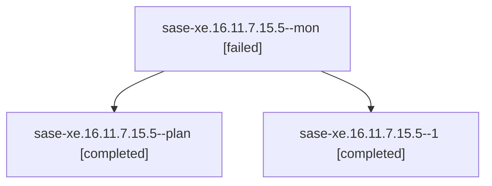

# Family: sase-xe.16.11.7.15.5

[Agent Hoods](../README.md) / [bbugyi200](../users/bbugyi200/README.md) / [apollo](../users/bbugyi200/machines/apollo/README.md) / [sase-xe](../users/bbugyi200/machines/apollo/hoods/sase-xe/README.md) / sase-xe.16.11.7.15.5

Owner: `bbugyi200.apollo` · Hood: `sase-xe` · Members: 3 · Bead: [sase-xe.16.11.7.15.5](https://github.com/sase-org/sase--beads/blob/main/pages/sase-xe/sase-xe.16.11.7.15.5.md)

## Lineage

The diagram is an optional enhancement; the ordered table below contains the same lineage in accessible text.

| Role | Agent | State | Model / provider | Timing | Commits | Prompt | Chat |
|---|---|---|---|---|---:|---|---|
| mon | sase-xe.16.11.7.15.5--mon | failed | sonnet / claude | 2026-09-14T13:22:22.594307+00:00 → 2026-09-14T13:51:45.954656+00:00 | 0 | — | [Chat](../agents/bbugyi200.apollo.sase-xe.16.11.7.15.5--mon/chat.md) |
| plan | sase-xe.16.11.7.15.5--plan | completed | sonnet / claude | 2026-09-14T12:39:30.342663+00:00 → 2026-09-14T13:22:52.136268+00:00 | 0 | [Prompt](../agents/bbugyi200.apollo.sase-xe.16.11.7.15.5--plan/prompt.md) | [Chat](../agents/bbugyi200.apollo.sase-xe.16.11.7.15.5--plan/chat.md) |
| 1 | sase-xe.16.11.7.15.5--1 | completed | sonnet / claude | 2026-09-14T13:51:45.495409+00:00 → 2026-09-14T14:01:09.634221+00:00 | [1](../agents/bbugyi200.apollo.sase-xe.16.11.7.15.5--1/README.md#commits) | [Prompt](../agents/bbugyi200.apollo.sase-xe.16.11.7.15.5--1/prompt.md) | [Chat](../agents/bbugyi200.apollo.sase-xe.16.11.7.15.5--1/chat.md) |

## Commits

| Role | Repo | Commit | Subject | Committed |
|---|---|---|---|---|
| 1 | sase | [`8ed00c4`](https://github.com/sase-org/sase/commit/8ed00c4ed67dc85abded7ea31ce8fce49b3cf865) | fix(ace-tui): map remote fleet-row identity fields and suppress stale online chrome | 2026-09-14 09:56:01 EDT |

## Neighbors

| Agent | Relation | State |
|---|---|---|
| [sase-xe.16.11.7.15.1](../agents/bbugyi200.apollo.sase-xe.16.11.7.15.1/README.md) | sase-xe.16.11.7.15 hood | completed |
| [sase-xe.16.11.7.15.2](bbugyi200.apollo.sase-xe.16.11.7.15.2.md) (family · 3) | sase-xe.16.11.7.15 hood | completed 2, failed 1 |
| [sase-xe.16.11.7.15.3](bbugyi200.apollo.sase-xe.16.11.7.15.3.md) (family · 5) | sase-xe.16.11.7.15 hood | completed 3, failed 2 |
| [sase-xe.16.11.7.15.4](bbugyi200.apollo.sase-xe.16.11.7.15.4.md) (family · 9) | sase-xe.16.11.7.15 hood | completed 5, failed 4 |
| [sase-xe.16.11.7.15.4](../agents/bbugyi200.apollo.sase-xe.16.11.7.15.4/README.md) | sase-xe.16.11.7.15 hood | completed |
| [sase-xe.16.11.7.15.6](../agents/bbugyi200.apollo.sase-xe.16.11.7.15.6/README.md) | sase-xe.16.11.7.15 hood | completed |
| [sase-xe.16.11.7.15.7](../agents/bbugyi200.apollo.sase-xe.16.11.7.15.7/README.md) | sase-xe.16.11.7.15 hood | completed |
| [sase-xe.16.11.7.15.land](../agents/bbugyi200.apollo.sase-xe.16.11.7.15.land/README.md) | sase-xe.16.11.7.15 hood | waiting |
| [sase-xe.16.11.7.16.1](../agents/bbugyi200.apollo.sase-xe.16.11.7.16.1/README.md) | sase-xe.16.11.7 hood | completed |
| [sase-xe.16.11.7.16.2](bbugyi200.apollo.sase-xe.16.11.7.16.2.md) (family · 3) | sase-xe.16.11.7 hood | completed 2, failed 1 |
| [sase-xe.16.11.7.16.3](bbugyi200.apollo.sase-xe.16.11.7.16.3.md) (family · 5) | sase-xe.16.11.7 hood | completed 3, failed 2 |
| [sase-xe.16.11.7.16.4](../agents/bbugyi200.apollo.sase-xe.16.11.7.16.4/README.md) | sase-xe.16.11.7 hood | completed |
| [sase-xe.16.11.7.16.5.1](../agents/bbugyi200.apollo.sase-xe.16.11.7.16.5.1/README.md) | sase-xe.16.11.7 hood | completed |
| [sase-xe.16.11.7.16.5.2](../agents/bbugyi200.apollo.sase-xe.16.11.7.16.5.2/README.md) | sase-xe.16.11.7 hood | completed |
| [sase-xe.16.11.7.16.5.3](../agents/bbugyi200.apollo.sase-xe.16.11.7.16.5.3/README.md) | sase-xe.16.11.7 hood | completed |
| [sase-xe.16.11.7.16.5.4](../agents/bbugyi200.apollo.sase-xe.16.11.7.16.5.4/README.md) | sase-xe.16.11.7 hood | completed |
| [sase-xe.16.11.7.16.5.5.1](../agents/bbugyi200.apollo.sase-xe.16.11.7.16.5.5.1/README.md) | sase-xe.16.11.7 hood | completed |
| [sase-xe.16.11.7.16.5.5.land](../agents/bbugyi200.apollo.sase-xe.16.11.7.16.5.5.land/README.md) | sase-xe.16.11.7 hood | active |
| [sase-xe.16.11.7.16.5.land](bbugyi200.apollo.sase-xe.16.11.7.16.5.land.md) (family · 3) | sase-xe.16.11.7 hood | failed 3 |
| [sase-xe.16.11.7.16.land](bbugyi200.apollo.sase-xe.16.11.7.16.land.md) (family · 3) | sase-xe.16.11.7 hood | failed 3 |
