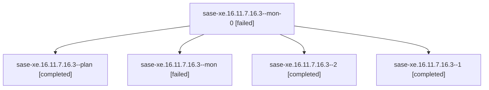

# Family: sase-xe.16.11.7.16.3

[Agent Hoods](../README.md) / [bbugyi200](../users/bbugyi200/README.md) / [apollo](../users/bbugyi200/machines/apollo/README.md) / [sase-xe](../users/bbugyi200/machines/apollo/hoods/sase-xe/README.md) / sase-xe.16.11.7.16.3

Owner: `bbugyi200.apollo` · Hood: `sase-xe` · Members: 5 · Bead: [sase-xe.16.11.7.16.3](https://github.com/sase-org/sase--beads/blob/main/pages/sase-xe/sase-xe.16.11.7.16.3.md)

## Lineage

The diagram is an optional enhancement; the ordered table below contains the same lineage in accessible text.

| Role | Agent | State | Model / provider | Timing | Commits | Prompt | Chat |
|---|---|---|---|---|---:|---|---|
| mon-0 | sase-xe.16.11.7.16.3--mon-0 | failed | sonnet / claude | 2026-09-14T21:32:08.031002+00:00 → 2026-09-14T22:01:47.689025+00:00 | 0 | — | [Chat](../agents/bbugyi200.apollo.sase-xe.16.11.7.16.3--mon-0/chat.md) |
| plan | sase-xe.16.11.7.16.3--plan | completed | sonnet / claude | 2026-09-14T21:01:49.250753+00:00 → 2026-09-14T21:26:33.432752+00:00 | 0 | [Prompt](../agents/bbugyi200.apollo.sase-xe.16.11.7.16.3--plan/prompt.md) | [Chat](../agents/bbugyi200.apollo.sase-xe.16.11.7.16.3--plan/chat.md) |
| mon | sase-xe.16.11.7.16.3--mon | failed | sonnet / claude | 2026-09-14T21:25:49.842105+00:00 → 2026-09-14T21:31:07.485559+00:00 | 0 | — | [Chat](../agents/bbugyi200.apollo.sase-xe.16.11.7.16.3--mon/chat.md) |
| 2 | sase-xe.16.11.7.16.3--2 | completed | sonnet / claude | 2026-09-14T22:01:47.192328+00:00 → 2026-09-14T22:08:43.770182+00:00 | [1](../agents/bbugyi200.apollo.sase-xe.16.11.7.16.3--2/README.md#commits) | [Prompt](../agents/bbugyi200.apollo.sase-xe.16.11.7.16.3--2/prompt.md) | [Chat](../agents/bbugyi200.apollo.sase-xe.16.11.7.16.3--2/chat.md) |
| 1 | sase-xe.16.11.7.16.3--1 | completed | sonnet / claude | 2026-09-14T21:31:07.423197+00:00 → 2026-09-14T21:32:39.647558+00:00 | 0 | [Prompt](../agents/bbugyi200.apollo.sase-xe.16.11.7.16.3--1/prompt.md) | [Chat](../agents/bbugyi200.apollo.sase-xe.16.11.7.16.3--1/chat.md) |

## Commits

| Role | Repo | Commit | Subject | Committed |
|---|---|---|---|---|
| 2 | sase | [`0b1a480`](https://github.com/sase-org/sase/commit/0b1a4806d6b7568a61d67be4f203819b85ef775e) | fix(tui): render invalid or stale remote-host feed status loudly | 2026-09-14 18:04:15 EDT |

## Neighbors

| Agent | Relation | State |
|---|---|---|
| [sase-xe.16.11.7.16.1](../agents/bbugyi200.apollo.sase-xe.16.11.7.16.1/README.md) | sase-xe.16.11.7.16 hood | completed |
| [sase-xe.16.11.7.16.2](bbugyi200.apollo.sase-xe.16.11.7.16.2.md) (family · 3) | sase-xe.16.11.7.16 hood | completed 2, failed 1 |
| [sase-xe.16.11.7.16.4](../agents/bbugyi200.apollo.sase-xe.16.11.7.16.4/README.md) | sase-xe.16.11.7.16 hood | completed |
| [sase-xe.16.11.7.16.5.1](../agents/bbugyi200.apollo.sase-xe.16.11.7.16.5.1/README.md) | sase-xe.16.11.7.16 hood | active |
| [sase-xe.16.11.7.16.5.2](../agents/bbugyi200.apollo.sase-xe.16.11.7.16.5.2/README.md) | sase-xe.16.11.7.16 hood | completed |
| [sase-xe.16.11.7.16.5.3](../agents/bbugyi200.apollo.sase-xe.16.11.7.16.5.3/README.md) | sase-xe.16.11.7.16 hood | active |
| [sase-xe.16.11.7.16.5.4](../agents/bbugyi200.apollo.sase-xe.16.11.7.16.5.4/README.md) | sase-xe.16.11.7.16 hood | waiting |
| [sase-xe.16.11.7.16.5.land](../agents/bbugyi200.apollo.sase-xe.16.11.7.16.5.land/README.md) | sase-xe.16.11.7.16 hood | waiting |
| [sase-xe.16.11.7.16.land](bbugyi200.apollo.sase-xe.16.11.7.16.land.md) (family · 3) | sase-xe.16.11.7.16 hood | failed 3 |
| [sase-xe.16.11.7.15.1](../agents/bbugyi200.apollo.sase-xe.16.11.7.15.1/README.md) | sase-xe.16.11.7 hood | completed |
| [sase-xe.16.11.7.15.2](bbugyi200.apollo.sase-xe.16.11.7.15.2.md) (family · 3) | sase-xe.16.11.7 hood | completed 2, failed 1 |
| [sase-xe.16.11.7.15.3](bbugyi200.apollo.sase-xe.16.11.7.15.3.md) (family · 5) | sase-xe.16.11.7 hood | completed 3, failed 2 |
| [sase-xe.16.11.7.15.4](bbugyi200.apollo.sase-xe.16.11.7.15.4.md) (family · 9) | sase-xe.16.11.7 hood | completed 5, failed 4 |
| [sase-xe.16.11.7.15.4](../agents/bbugyi200.apollo.sase-xe.16.11.7.15.4/README.md) | sase-xe.16.11.7 hood | completed |
| [sase-xe.16.11.7.15.5](bbugyi200.apollo.sase-xe.16.11.7.15.5.md) (family · 3) | sase-xe.16.11.7 hood | completed 2, failed 1 |
| [sase-xe.16.11.7.15.6](../agents/bbugyi200.apollo.sase-xe.16.11.7.15.6/README.md) | sase-xe.16.11.7 hood | completed |
| [sase-xe.16.11.7.15.7](../agents/bbugyi200.apollo.sase-xe.16.11.7.15.7/README.md) | sase-xe.16.11.7 hood | completed |
| [sase-xe.16.11.7.15.land](../agents/bbugyi200.apollo.sase-xe.16.11.7.15.land/README.md) | sase-xe.16.11.7 hood | waiting |
