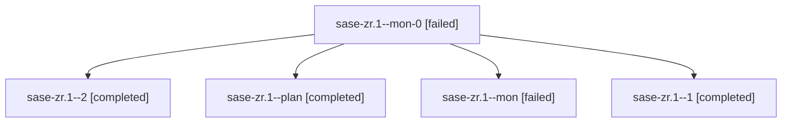

# Family: sase-zr.1

[Agent Hoods](../README.md) / [bbugyi200](../users/bbugyi200/README.md) / [apollo](../users/bbugyi200/machines/apollo/README.md) / [sase-zr](../users/bbugyi200/machines/apollo/hoods/sase-zr/README.md) / sase-zr.1

Owner: `bbugyi200.apollo` · Hood: `sase-zr` · Members: 5 · Bead: [sase-zr.1](https://github.com/sase-org/sase--beads/blob/main/pages/sase-zr/sase-zr.1.md)

## Lineage

The diagram is an optional enhancement; the ordered table below contains the same lineage in accessible text.

| Role | Agent | State | Model / provider | Timing | Commits | Prompt | Chat |
|---|---|---|---|---|---:|---|---|
| mon-0 | sase-zr.1--mon-0 | failed | sonnet / claude | 2026-09-13T22:42:36.274524+00:00 → 2026-09-13T23:07:57.346820+00:00 | 0 | — | [Chat](../agents/bbugyi200.apollo.sase-zr.1--mon-0/chat.md) |
| 2 | sase-zr.1--2 | completed | sonnet / claude | 2026-09-13T23:07:57.297806+00:00 → 2026-09-13T23:21:33.626147+00:00 | 0 | [Prompt](../agents/bbugyi200.apollo.sase-zr.1--2/prompt.md) | [Chat](../agents/bbugyi200.apollo.sase-zr.1--2/chat.md) |
| plan | sase-zr.1--plan | completed | sonnet / claude | 2026-09-13T21:13:00.350340+00:00 → 2026-09-13T22:21:13.827380+00:00 | [1](../agents/bbugyi200.apollo.sase-zr.1--plan/README.md#commits) | [Prompt](../agents/bbugyi200.apollo.sase-zr.1--plan/prompt.md) | [Chat](../agents/bbugyi200.apollo.sase-zr.1--plan/chat.md) |
| mon | sase-zr.1--mon | failed | sonnet / claude | 2026-09-13T22:20:55.585179+00:00 → 2026-09-13T22:41:11.995864+00:00 | 0 | — | [Chat](../agents/bbugyi200.apollo.sase-zr.1--mon/chat.md) |
| 1 | sase-zr.1--1 | completed | sonnet / claude | 2026-09-13T22:41:11.706132+00:00 → 2026-09-13T22:42:52.457090+00:00 | 0 | [Prompt](../agents/bbugyi200.apollo.sase-zr.1--1/prompt.md) | [Chat](../agents/bbugyi200.apollo.sase-zr.1--1/chat.md) |

## Commits

| Role | Repo | Commit | Subject | Committed |
|---|---|---|---|---|
| plan | sase | [`93f3d58`](https://github.com/sase-org/sase/commit/93f3d58911b9968575bd08676c65b3577e01e016) | feat(gate-shell): add indexed gate-shell-by-gate-id lookup with telemetry | 2026-09-13 19:12:59 EDT |

## Neighbors

| Agent | Relation | State |
|---|---|---|
| [sase-zr.2](bbugyi200.apollo.sase-zr.2.md) (family · 3) | sase-zr hood | completed 2, failed 1 |
| [sase-zr.2](../agents/bbugyi200.apollo.sase-zr.2/README.md) | sase-zr hood | completed |
| [sase-zr.3](../agents/bbugyi200.apollo.sase-zr.3/README.md) | sase-zr hood | active |
| [sase-zr.4](../agents/bbugyi200.apollo.sase-zr.4/README.md) | sase-zr hood | completed |
| [sase-zr.5](bbugyi200.apollo.sase-zr.5.md) (family · 3) | sase-zr hood | active 3 |
| [sase-zr.6](../agents/bbugyi200.apollo.sase-zr.6/README.md) | sase-zr hood | waiting |
| [sase-zr.land](../agents/bbugyi200.apollo.sase-zr.land/README.md) | sase-zr hood | waiting |
