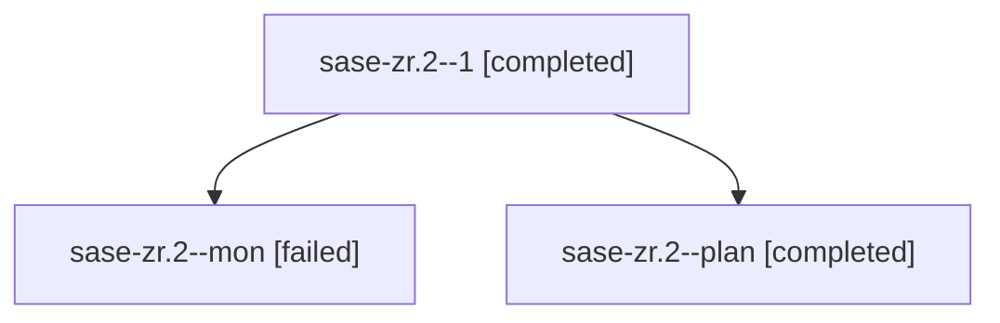

# Family: sase-zr.2

[Agent Hoods](../README.md) / [bbugyi200](../users/bbugyi200/README.md) / [apollo](../users/bbugyi200/machines/apollo/README.md) / [sase-zr](../users/bbugyi200/machines/apollo/hoods/sase-zr/README.md) / sase-zr.2

Owner: `bbugyi200.apollo` · Hood: `sase-zr` · Members: 3 · Bead: [sase-zr.2](https://github.com/sase-org/sase--beads/blob/main/pages/sase-zr/sase-zr.2.md)

## Lineage

The diagram is an optional enhancement; the ordered table below contains the same lineage in accessible text.

| Role | Agent | State | Model / provider | Timing | Commits | Prompt | Chat |
|---|---|---|---|---|---:|---|---|
| 1 | sase-zr.2--1 | completed | gpt-5.5 / codex | 2026-09-14T11:23:01.551000+00:00 → 2026-09-14T13:00:40.720415+00:00 | [1](../agents/bbugyi200.apollo.sase-zr.2--1/README.md#commits) | [Prompt](../agents/bbugyi200.apollo.sase-zr.2--1/prompt.md) | [Chat](../agents/bbugyi200.apollo.sase-zr.2--1/chat.md) |
| mon | sase-zr.2--mon | failed | sonnet / claude | 2026-09-14T11:14:05.783226+00:00 → 2026-09-14T11:23:01.693809+00:00 | 0 | — | [Chat](../agents/bbugyi200.apollo.sase-zr.2--mon/chat.md) |
| plan | sase-zr.2--plan | completed | sonnet / claude | 2026-09-14T11:06:58.010623+00:00 → 2026-09-14T11:14:35.376744+00:00 | 0 | [Prompt](../agents/bbugyi200.apollo.sase-zr.2--plan/prompt.md) | [Chat](../agents/bbugyi200.apollo.sase-zr.2--plan/chat.md) |

## Commits

| Role | Repo | Commit | Subject | Committed |
|---|---|---|---|---|
| — | sase | [`c8152f4`](https://github.com/sase-org/sase/commit/c8152f4978272b6c6cce30ec9f23470926fff144) | feat(gate-shell): accept gate decisions durably before slow execution | 2026-09-13 21:51:48 EDT |
| 1 | sase | [`d2ba89c`](https://github.com/sase-org/sase/commit/d2ba89cb420aea18ac27b4192e6bb49731729cbd) | fix(monitor): keep lookup helpers private | 2026-09-14 08:59:17 EDT |

## Neighbors

| Agent | Relation | State |
|---|---|---|
| [sase-zr.1](bbugyi200.apollo.sase-zr.1.md) (family · 5) | sase-zr hood | completed 3, failed 2 |
| [sase-zr.1](../agents/bbugyi200.apollo.sase-zr.1/README.md) | sase-zr hood | completed |
| [sase-zr.3](../agents/bbugyi200.apollo.sase-zr.3/README.md) | sase-zr hood | active |
| [sase-zr.4](../agents/bbugyi200.apollo.sase-zr.4/README.md) | sase-zr hood | completed |
| [sase-zr.5](bbugyi200.apollo.sase-zr.5.md) (family · 3) | sase-zr hood | active 1, failed 2 |
| [sase-zr.6](../agents/bbugyi200.apollo.sase-zr.6/README.md) | sase-zr hood | waiting |
| [sase-zr.land](../agents/bbugyi200.apollo.sase-zr.land/README.md) | sase-zr hood | waiting |
