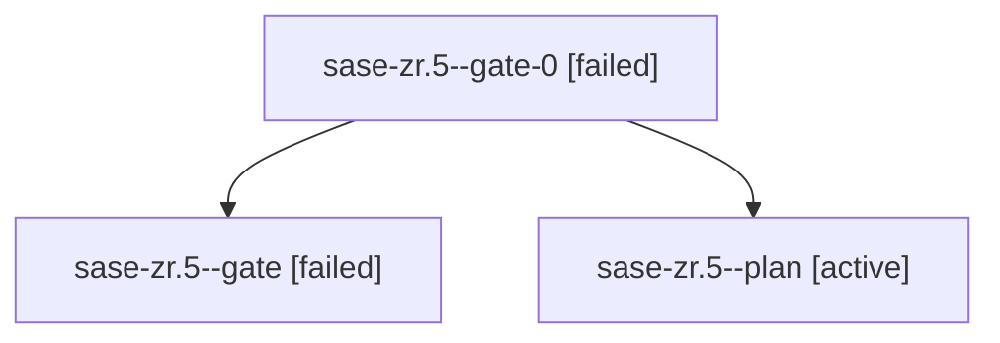

# Family: sase-zr.5

[Agent Hoods](../README.md) / [bbugyi200](../users/bbugyi200/README.md) / [apollo](../users/bbugyi200/machines/apollo/README.md) / [sase-zr](../users/bbugyi200/machines/apollo/hoods/sase-zr/README.md) / sase-zr.5

Owner: `bbugyi200.apollo` · Hood: `sase-zr` · Members: 3 · Bead: [sase-zr.5](https://github.com/sase-org/sase--beads/blob/main/pages/sase-zr/sase-zr.5.md)

## Lineage

The diagram is an optional enhancement; the ordered table below contains the same lineage in accessible text.

| Role | Agent | State | Model / provider | Timing | Commits | Prompt | Chat |
|---|---|---|---|---|---:|---|---|
| gate-0 | sase-zr.5--gate-0 | failed | sonnet / claude | 2026-09-14T14:24:41.113549+00:00 → 2026-09-14T15:20:36.709973+00:00 | 0 | — | [Chat](../agents/bbugyi200.apollo.sase-zr.5--gate-0/chat.md) |
| gate | sase-zr.5--gate | failed | sonnet / claude | 2026-09-14T14:22:30.342229+00:00 → 2026-09-14T15:20:38.041335+00:00 | 0 | — | [Chat](../agents/bbugyi200.apollo.sase-zr.5--gate/chat.md) |
| plan | sase-zr.5--plan | active | sonnet / claude | 2026-09-14T13:44:34.530905+00:00 | 0 | [Prompt](../agents/bbugyi200.apollo.sase-zr.5--plan/prompt.md) | [Chat](../agents/bbugyi200.apollo.sase-zr.5--plan/chat.md) |

## Neighbors

| Agent | Relation | State |
|---|---|---|
| [sase-zr.1](bbugyi200.apollo.sase-zr.1.md) (family · 5) | sase-zr hood | active 5 |
| [sase-zr.1](../agents/bbugyi200.apollo.sase-zr.1/README.md) | sase-zr hood | completed |
| [sase-zr.2](bbugyi200.apollo.sase-zr.2.md) (family · 3) | sase-zr hood | active 3 |
| [sase-zr.2](../agents/bbugyi200.apollo.sase-zr.2/README.md) | sase-zr hood | completed |
| [sase-zr.3](../agents/bbugyi200.apollo.sase-zr.3/README.md) | sase-zr hood | active |
| [sase-zr.4](../agents/bbugyi200.apollo.sase-zr.4/README.md) | sase-zr hood | active |
| [sase-zr.6](bbugyi200.apollo.sase-zr.6.md) (family · 6) | sase-zr hood | active 6 |
| [sase-zr.7.1](bbugyi200.apollo.sase-zr.7.1.md) (family · 4) | sase-zr hood | active 1, failed 3 |
| [sase-zr.7.1.1.1](../agents/bbugyi200.apollo.sase-zr.7.1.1.1/README.md) | sase-zr hood | completed |
| [sase-zr.7.1.1.2](../agents/bbugyi200.apollo.sase-zr.7.1.1.2/README.md) | sase-zr hood | completed |
| [sase-zr.7.1.1.3](../agents/bbugyi200.apollo.sase-zr.7.1.1.3/README.md) | sase-zr hood | completed |
| [sase-zr.7.1.1.4](../agents/bbugyi200.apollo.sase-zr.7.1.1.4/README.md) | sase-zr hood | completed |
| [sase-zr.7.1.1.5.1](../agents/bbugyi200.apollo.sase-zr.7.1.1.5.1/README.md) | sase-zr hood | completed |
| [sase-zr.7.1.1.5.2](../agents/bbugyi200.apollo.sase-zr.7.1.1.5.2/README.md) | sase-zr hood | completed |
| [sase-zr.7.1.1.5.3](../agents/bbugyi200.apollo.sase-zr.7.1.1.5.3/README.md) | sase-zr hood | completed |
| [sase-zr.7.1.1.5.4.1](../agents/bbugyi200.apollo.sase-zr.7.1.1.5.4.1/README.md) | sase-zr hood | active |
| [sase-zr.7.1.1.5.4.2](../agents/bbugyi200.apollo.sase-zr.7.1.1.5.4.2/README.md) | sase-zr hood | waiting |
| [sase-zr.7.1.1.5.4.land](../agents/bbugyi200.apollo.sase-zr.7.1.1.5.4.land/README.md) | sase-zr hood | waiting |
| [sase-zr.7.1.1.5.land](bbugyi200.apollo.sase-zr.7.1.1.5.land.md) (family · 3) | sase-zr hood | failed 3 |
| [sase-zr.7.1.1.land](bbugyi200.apollo.sase-zr.7.1.1.land.md) (family · 3) | sase-zr hood | failed 3 |
| [sase-zr.7.2](../agents/bbugyi200.apollo.sase-zr.7.2/README.md) | sase-zr hood | waiting |
| [sase-zr.7.3](../agents/bbugyi200.apollo.sase-zr.7.3/README.md) | sase-zr hood | waiting |
| [sase-zr.7.4](../agents/bbugyi200.apollo.sase-zr.7.4/README.md) | sase-zr hood | completed |
| [sase-zr.7.5](../agents/bbugyi200.apollo.sase-zr.7.5/README.md) | sase-zr hood | waiting |
| [sase-zr.7.land](../agents/bbugyi200.apollo.sase-zr.7.land/README.md) | sase-zr hood | waiting |
| [sase-zr.land](../agents/bbugyi200.apollo.sase-zr.land/README.md) | sase-zr hood | waiting |
