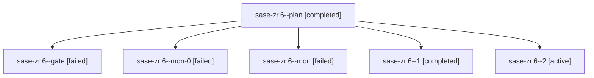

# Family: sase-zr.6

[Agent Hoods](../README.md) / [bbugyi200](../users/bbugyi200/README.md) / [apollo](../users/bbugyi200/machines/apollo/README.md) / [sase-zr](../users/bbugyi200/machines/apollo/hoods/sase-zr/README.md) / sase-zr.6

Owner: `bbugyi200.apollo` · Hood: `sase-zr` · Members: 6 · Bead: [sase-zr.6](https://github.com/sase-org/sase--beads/blob/main/pages/sase-zr/sase-zr.6.md)

## Lineage

The diagram is an optional enhancement; the ordered table below contains the same lineage in accessible text.

| Role | Agent | State | Model / provider | Timing | Commits | Prompt | Chat |
|---|---|---|---|---|---:|---|---|
| plan | sase-zr.6--plan | completed | gpt-5.5 / codex | 2026-09-14T18:19:42.947671+00:00 → 2026-09-14T19:35:45.888519+00:00 | 0 | [Prompt](../agents/bbugyi200.apollo.sase-zr.6--plan/prompt.md) | [Chat](../agents/bbugyi200.apollo.sase-zr.6--plan/chat.md) |
| gate | sase-zr.6--gate | failed | gpt-5.5 / codex | 2026-09-14T18:48:27.437736+00:00 → 2026-09-14T19:36:02.834032+00:00 | 0 | — | [Chat](../agents/bbugyi200.apollo.sase-zr.6--gate/chat.md) |
| mon-0 | sase-zr.6--mon-0 | failed | sonnet / claude | 2026-09-14T21:36:56.712086+00:00 → 2026-09-14T23:23:13.216170+00:00 | 0 | — | [Chat](../agents/bbugyi200.apollo.sase-zr.6--mon-0/chat.md) |
| mon | sase-zr.6--mon | failed | gpt-5.5 / codex | 2026-09-14T19:35:26.239902+00:00 → 2026-09-14T21:35:46.019018+00:00 | 0 | — | [Chat](../agents/bbugyi200.apollo.sase-zr.6--mon/chat.md) |
| 1 | sase-zr.6--1 | completed | sonnet / claude | 2026-09-14T21:35:45.615247+00:00 → 2026-09-14T21:37:17.465674+00:00 | 0 | [Prompt](../agents/bbugyi200.apollo.sase-zr.6--1/prompt.md) | [Chat](../agents/bbugyi200.apollo.sase-zr.6--1/chat.md) |
| 2 | sase-zr.6--2 | active | sonnet / claude | 2026-09-14T23:23:12.737243+00:00 | [1](../agents/bbugyi200.apollo.sase-zr.6--2/README.md#commits) | [Prompt](../agents/bbugyi200.apollo.sase-zr.6--2/prompt.md) | — |

## Commits

| Role | Repo | Commit | Subject | Committed |
|---|---|---|---|---|
| 2 | sase | [`7f7700d`](https://github.com/sase-org/sase/commit/7f7700d030c3806b56e326db9567cfa9345cc2f5) | docs(notifications): document gate decision receipts, rollout order, and latency probes | 2026-09-14 19:28:12 EDT |

## Neighbors

| Agent | Relation | State |
|---|---|---|
| [sase-zr.1](bbugyi200.apollo.sase-zr.1.md) (family · 5) | sase-zr hood | completed 3, failed 2 |
| [sase-zr.1](../agents/bbugyi200.apollo.sase-zr.1/README.md) | sase-zr hood | completed |
| [sase-zr.2](bbugyi200.apollo.sase-zr.2.md) (family · 3) | sase-zr hood | completed 2, failed 1 |
| [sase-zr.2](../agents/bbugyi200.apollo.sase-zr.2/README.md) | sase-zr hood | completed |
| [sase-zr.3](../agents/bbugyi200.apollo.sase-zr.3/README.md) | sase-zr hood | completed |
| [sase-zr.4](../agents/bbugyi200.apollo.sase-zr.4/README.md) | sase-zr hood | completed |
| [sase-zr.5](bbugyi200.apollo.sase-zr.5.md) (family · 3) | sase-zr hood | active 1, failed 2 |
| [sase-zr.land](../agents/bbugyi200.apollo.sase-zr.land/README.md) | sase-zr hood | waiting |
