# Family: sase-zr.7.1.1.5.4.2

[Agent Hoods](../README.md) / [bbugyi200](../users/bbugyi200/README.md) / [apollo](../users/bbugyi200/machines/apollo/README.md) / [sase-zr](../users/bbugyi200/machines/apollo/hoods/sase-zr/README.md) / sase-zr.7.1.1.5.4.2

Owner: `bbugyi200.apollo` · Hood: `sase-zr` · Members: 21 · Bead: [sase-zr.7.1.1.5.4.2](https://github.com/sase-org/sase--beads/blob/main/pages/sase-zr/sase-zr.7.1.1.5.4.2.md)

## Lineage

```mermaid
flowchart TD
  n0["sase-zr.7.1.1.5.4.2--mon-1 [failed]"]
  n1["sase-zr.7.1.1.5.4.2--mon-7 [failed]"]
  n0 --> n1
  n2["sase-zr.7.1.1.5.4.2--3 [completed]"]
  n0 --> n2
  n3["sase-zr.7.1.1.5.4.2--4 [completed]"]
  n0 --> n3
  n4["sase-zr.7.1.1.5.4.2--mon [failed]"]
  n0 --> n4
  n5["sase-zr.7.1.1.5.4.2--plan [completed]"]
  n0 --> n5
  n6["sase-zr.7.1.1.5.4.2--mon-6 [failed]"]
  n0 --> n6
  n7["sase-zr.7.1.1.5.4.2--8 [completed]"]
  n0 --> n7
  n8["sase-zr.7.1.1.5.4.2--7 [completed]"]
  n0 --> n8
  n9["sase-zr.7.1.1.5.4.2--mon-5 [failed]"]
  n0 --> n9
  n10["sase-zr.7.1.1.5.4.2--9 [completed]"]
  n0 --> n10
  n11["sase-zr.7.1.1.5.4.2--1 [completed]"]
  n0 --> n11
  n12["sase-zr.7.1.1.5.4.2--mon-8 [failed]"]
  n0 --> n12
  n13["sase-zr.7.1.1.5.4.2--mon-3 [failed]"]
  n0 --> n13
  n14["sase-zr.7.1.1.5.4.2--mon-4 [failed]"]
  n0 --> n14
  n15["sase-zr.7.1.1.5.4.2--mon-0 [failed]"]
  n0 --> n15
  n16["sase-zr.7.1.1.5.4.2--5 [completed]"]
  n0 --> n16
  n17["sase-zr.7.1.1.5.4.2--2 [completed]"]
  n0 --> n17
  n18["sase-zr.7.1.1.5.4.2--6 [completed]"]
  n0 --> n18
  n19["sase-zr.7.1.1.5.4.2--a [completed]"]
  n0 --> n19
  n20["sase-zr.7.1.1.5.4.2--mon-2 [failed]"]
  n0 --> n20
```

The diagram is an optional enhancement; the ordered table below contains the same lineage in accessible text.

| Role | Agent | State | Model / provider | Timing | Commits | Prompt | Chat |
|---|---|---|---|---|---:|---|---|
| mon-1 | sase-zr.7.1.1.5.4.2--mon-1 | failed | gpt-5.5 / codex | 2026-09-18T19:47:21.852057+00:00 → 2026-09-18T19:49:33.513618+00:00 | 0 | — | [Chat](../agents/bbugyi200.apollo.sase-zr.7.1.1.5.4.2--mon-1/chat.md) |
| mon-7 | sase-zr.7.1.1.5.4.2--mon-7 | failed | grok-4.6 / grok | 2026-09-19T06:17:42.625792+00:00 → 2026-09-19T08:15:10.792681+00:00 | 0 | — | [Chat](../agents/bbugyi200.apollo.sase-zr.7.1.1.5.4.2--mon-7/chat.md) |
| 3 | sase-zr.7.1.1.5.4.2--3 | completed | grok-4.6 / grok | 2026-09-18T19:49:33.124823+00:00 → 2026-09-18T19:58:51.187904+00:00 | 0 | [Prompt](../agents/bbugyi200.apollo.sase-zr.7.1.1.5.4.2--3/prompt.md) | [Chat](../agents/bbugyi200.apollo.sase-zr.7.1.1.5.4.2--3/chat.md) |
| 4 | sase-zr.7.1.1.5.4.2--4 | completed | grok-4.6 / grok | 2026-09-18T20:03:07.472959+00:00 → 2026-09-18T20:10:08.571984+00:00 | 0 | [Prompt](../agents/bbugyi200.apollo.sase-zr.7.1.1.5.4.2--4/prompt.md) | [Chat](../agents/bbugyi200.apollo.sase-zr.7.1.1.5.4.2--4/chat.md) |
| mon | sase-zr.7.1.1.5.4.2--mon | failed | gpt-5.5 / codex | 2026-09-18T10:13:27.139781+00:00 → 2026-09-18T11:43:55.237036+00:00 | 0 | — | [Chat](../agents/bbugyi200.apollo.sase-zr.7.1.1.5.4.2--mon/chat.md) |
| plan | sase-zr.7.1.1.5.4.2--plan | completed | gpt-5.5 / codex | 2026-09-18T09:52:20.776269+00:00 → 2026-09-18T10:13:47.688538+00:00 | 0 | [Prompt](../agents/bbugyi200.apollo.sase-zr.7.1.1.5.4.2--plan/prompt.md) | [Chat](../agents/bbugyi200.apollo.sase-zr.7.1.1.5.4.2--plan/chat.md) |
| mon-6 | sase-zr.7.1.1.5.4.2--mon-6 | failed | grok-4.6 / grok | 2026-09-19T04:08:27.102178+00:00 → 2026-09-19T06:05:28.181103+00:00 | 0 | — | [Chat](../agents/bbugyi200.apollo.sase-zr.7.1.1.5.4.2--mon-6/chat.md) |
| 8 | sase-zr.7.1.1.5.4.2--8 | completed | grok-4.6 / grok | 2026-09-19T06:05:28.138997+00:00 → 2026-09-19T06:18:09.272593+00:00 | 0 | [Prompt](../agents/bbugyi200.apollo.sase-zr.7.1.1.5.4.2--8/prompt.md) | [Chat](../agents/bbugyi200.apollo.sase-zr.7.1.1.5.4.2--8/chat.md) |
| 7 | sase-zr.7.1.1.5.4.2--7 | completed | grok-4.6 / grok | 2026-09-19T03:45:22.998653+00:00 → 2026-09-19T04:08:51.960775+00:00 | 0 | [Prompt](../agents/bbugyi200.apollo.sase-zr.7.1.1.5.4.2--7/prompt.md) | [Chat](../agents/bbugyi200.apollo.sase-zr.7.1.1.5.4.2--7/chat.md) |
| mon-5 | sase-zr.7.1.1.5.4.2--mon-5 | failed | grok-4.6 / grok | 2026-09-19T01:37:13.230327+00:00 → 2026-09-19T03:45:23.497934+00:00 | 0 | — | [Chat](../agents/bbugyi200.apollo.sase-zr.7.1.1.5.4.2--mon-5/chat.md) |
| 9 | sase-zr.7.1.1.5.4.2--9 | completed | grok-4.6 / grok | 2026-09-19T08:15:10.534595+00:00 → 2026-09-19T08:59:58.225833+00:00 | 0 | [Prompt](../agents/bbugyi200.apollo.sase-zr.7.1.1.5.4.2--9/prompt.md) | [Chat](../agents/bbugyi200.apollo.sase-zr.7.1.1.5.4.2--9/chat.md) |
| 1 | sase-zr.7.1.1.5.4.2--1 | completed | gpt-5.5 / codex | 2026-09-18T11:43:54.968132+00:00 → 2026-09-18T16:33:28.005715+00:00 | 0 | [Prompt](../agents/bbugyi200.apollo.sase-zr.7.1.1.5.4.2--1/prompt.md) | [Chat](../agents/bbugyi200.apollo.sase-zr.7.1.1.5.4.2--1/chat.md) |
| mon-8 | sase-zr.7.1.1.5.4.2--mon-8 | failed | grok-4.6 / grok | 2026-09-19T08:59:27.831094+00:00 → 2026-09-19T11:17:27.851371+00:00 | 0 | — | [Chat](../agents/bbugyi200.apollo.sase-zr.7.1.1.5.4.2--mon-8/chat.md) |
| mon-3 | sase-zr.7.1.1.5.4.2--mon-3 | failed | grok-4.6 / grok | 2026-09-18T20:09:37.204276+00:00 → 2026-09-18T20:18:42.740791+00:00 | 0 | — | [Chat](../agents/bbugyi200.apollo.sase-zr.7.1.1.5.4.2--mon-3/chat.md) |
| mon-4 | sase-zr.7.1.1.5.4.2--mon-4 | failed | gpt-5.5 / codex | 2026-09-18T21:45:28.511214+00:00 → 2026-09-19T00:45:04.373667+00:00 | 0 | — | [Chat](../agents/bbugyi200.apollo.sase-zr.7.1.1.5.4.2--mon-4/chat.md) |
| mon-0 | sase-zr.7.1.1.5.4.2--mon-0 | failed | gpt-5.5 / codex | 2026-09-18T16:32:56.565029+00:00 → 2026-09-18T19:24:01.678082+00:00 | 0 | — | [Chat](../agents/bbugyi200.apollo.sase-zr.7.1.1.5.4.2--mon-0/chat.md) |
| 5 | sase-zr.7.1.1.5.4.2--5 | completed | gpt-5.5 / codex | 2026-09-18T20:18:42.250912+00:00 → 2026-09-18T21:45:59.619309+00:00 | 0 | [Prompt](../agents/bbugyi200.apollo.sase-zr.7.1.1.5.4.2--5/prompt.md) | [Chat](../agents/bbugyi200.apollo.sase-zr.7.1.1.5.4.2--5/chat.md) |
| 2 | sase-zr.7.1.1.5.4.2--2 | completed | gpt-5.5 / codex | 2026-09-18T19:24:01.177499+00:00 → 2026-09-18T19:47:44.090182+00:00 | 0 | [Prompt](../agents/bbugyi200.apollo.sase-zr.7.1.1.5.4.2--2/prompt.md) | [Chat](../agents/bbugyi200.apollo.sase-zr.7.1.1.5.4.2--2/chat.md) |
| 6 | sase-zr.7.1.1.5.4.2--6 | completed | grok-4.6 / grok | 2026-09-19T00:45:04.028040+00:00 → 2026-09-19T01:37:38.060171+00:00 | 0 | [Prompt](../agents/bbugyi200.apollo.sase-zr.7.1.1.5.4.2--6/prompt.md) | [Chat](../agents/bbugyi200.apollo.sase-zr.7.1.1.5.4.2--6/chat.md) |
| a | sase-zr.7.1.1.5.4.2--a | completed | grok-4.6 / grok | 2026-09-19T11:17:27.385807+00:00 → 2026-09-19T11:37:05.242057+00:00 | [1](../agents/bbugyi200.apollo.sase-zr.7.1.1.5.4.2--a/README.md#commits) | [Prompt](../agents/bbugyi200.apollo.sase-zr.7.1.1.5.4.2--a/prompt.md) | [Chat](../agents/bbugyi200.apollo.sase-zr.7.1.1.5.4.2--a/chat.md) |
| mon-2 | sase-zr.7.1.1.5.4.2--mon-2 | failed | grok-4.6 / grok | 2026-09-18T19:58:17.084244+00:00 → 2026-09-18T20:03:07.529368+00:00 | 0 | — | [Chat](../agents/bbugyi200.apollo.sase-zr.7.1.1.5.4.2--mon-2/chat.md) |

## Commits

| Role | Repo | Commit | Subject | Committed |
|---|---|---|---|---|
| a | sase | [`8989d0a`](https://github.com/sase-org/sase/commit/8989d0a724b701c8816b8f004b8d033306c1dd47) | test: add requester recovery acceptance for launch, HITL, and plan archive | 2026-09-19 07:34:34 EDT |

## Neighbors

| Agent | Relation | State |
|---|---|---|
| [sase-zr.7.1](bbugyi200.apollo.sase-zr.7.1.md) (family · 4) | ancestor | active 1, failed 3 |
| [sase-zr.7.1.1.5.4.1](../agents/bbugyi200.apollo.sase-zr.7.1.1.5.4.1/README.md) | sase-zr.7.1.1.5.4 hood | completed |
| [sase-zr.7.1.1.5.4.land](../agents/bbugyi200.apollo.sase-zr.7.1.1.5.4.land/README.md) | sase-zr.7.1.1.5.4 hood | completed |
| [sase-zr.7.1.1.5.1](../agents/bbugyi200.apollo.sase-zr.7.1.1.5.1/README.md) | sase-zr.7.1.1.5 hood | completed |
| [sase-zr.7.1.1.5.2](../agents/bbugyi200.apollo.sase-zr.7.1.1.5.2/README.md) | sase-zr.7.1.1.5 hood | completed |
| [sase-zr.7.1.1.5.3](../agents/bbugyi200.apollo.sase-zr.7.1.1.5.3/README.md) | sase-zr.7.1.1.5 hood | completed |
| [sase-zr.7.1.1.5.land](bbugyi200.apollo.sase-zr.7.1.1.5.land.md) (family · 3) | sase-zr.7.1.1.5 hood | failed 3 |
| [sase-zr.7.1.1.1](../agents/bbugyi200.apollo.sase-zr.7.1.1.1/README.md) | sase-zr.7.1.1 hood | completed |
| [sase-zr.7.1.1.2](../agents/bbugyi200.apollo.sase-zr.7.1.1.2/README.md) | sase-zr.7.1.1 hood | completed |
| [sase-zr.7.1.1.3](../agents/bbugyi200.apollo.sase-zr.7.1.1.3/README.md) | sase-zr.7.1.1 hood | completed |
| [sase-zr.7.1.1.4](../agents/bbugyi200.apollo.sase-zr.7.1.1.4/README.md) | sase-zr.7.1.1 hood | completed |
| [sase-zr.7.1.1.land](bbugyi200.apollo.sase-zr.7.1.1.land.md) (family · 3) | sase-zr.7.1.1 hood | failed 3 |
| [sase-zr.7.2](bbugyi200.apollo.sase-zr.7.2.md) (family · 3) | sase-zr.7 hood | active 1, completed 1, failed 1 |
| [sase-zr.7.3](../agents/bbugyi200.apollo.sase-zr.7.3/README.md) | sase-zr.7 hood | waiting |
| [sase-zr.7.4](../agents/bbugyi200.apollo.sase-zr.7.4/README.md) | sase-zr.7 hood | completed |
| [sase-zr.7.5](../agents/bbugyi200.apollo.sase-zr.7.5/README.md) | sase-zr.7 hood | waiting |
| [sase-zr.7.land](../agents/bbugyi200.apollo.sase-zr.7.land/README.md) | sase-zr.7 hood | waiting |
| [sase-zr.1](bbugyi200.apollo.sase-zr.1.md) (family · 5) | sase-zr hood | active 5 |
| [sase-zr.1](../agents/bbugyi200.apollo.sase-zr.1/README.md) | sase-zr hood | completed |
| [sase-zr.2](bbugyi200.apollo.sase-zr.2.md) (family · 3) | sase-zr hood | active 3 |
| [sase-zr.2](../agents/bbugyi200.apollo.sase-zr.2/README.md) | sase-zr hood | completed |
| [sase-zr.3](../agents/bbugyi200.apollo.sase-zr.3/README.md) | sase-zr hood | active |
| [sase-zr.4](../agents/bbugyi200.apollo.sase-zr.4/README.md) | sase-zr hood | active |
| [sase-zr.5](bbugyi200.apollo.sase-zr.5.md) (family · 3) | sase-zr hood | active 1, failed 2 |
| [sase-zr.6](bbugyi200.apollo.sase-zr.6.md) (family · 6) | sase-zr hood | active 6 |
| [sase-zr.land](../agents/bbugyi200.apollo.sase-zr.land/README.md) | sase-zr hood | waiting |
