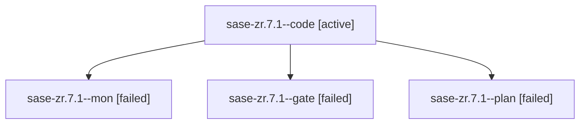

# Family: sase-zr.7.1

[Agent Hoods](../README.md) / [bbugyi200](../users/bbugyi200/README.md) / [apollo](../users/bbugyi200/machines/apollo/README.md) / [sase-zr](../users/bbugyi200/machines/apollo/hoods/sase-zr/README.md) / sase-zr.7.1

Owner: `bbugyi200.apollo` · Hood: `sase-zr` · Members: 4 · Bead: [sase-zr.7.1](https://github.com/sase-org/sase--beads/blob/main/pages/sase-zr/sase-zr.7.1.md)

## Lineage

The diagram is an optional enhancement; the ordered table below contains the same lineage in accessible text.

| Role | Agent | State | Model / provider | Timing | Commits | Prompt | Chat |
|---|---|---|---|---|---:|---|---|
| code | sase-zr.7.1--code | active | sonnet / claude | 2026-09-16T18:33:53.658158+00:00 | 0 | — | — |
| mon | sase-zr.7.1--mon | failed | opus / claude | 2026-09-17T10:47:12.550368+00:00 → 2026-09-17T10:48:44.655470+00:00 | 0 | — | [Chat](../agents/bbugyi200.apollo.sase-zr.7.1--mon/chat.md) |
| gate | sase-zr.7.1--gate | failed | opus / claude | 2026-09-17T10:47:07.503388+00:00 → 2026-09-17T10:47:14.188134+00:00 | 0 | — | [Chat](../agents/bbugyi200.apollo.sase-zr.7.1--gate/chat.md) |
| plan | sase-zr.7.1--plan | failed | opus / claude | 2026-09-17T10:29:21.540603+00:00 → 2026-09-17T10:47:21.779755+00:00 | 0 | [Prompt](../agents/bbugyi200.apollo.sase-zr.7.1--plan/prompt.md) | [Chat](../agents/bbugyi200.apollo.sase-zr.7.1--plan/chat.md) |

## Neighbors

| Agent | Relation | State |
|---|---|---|
| [sase-zr.7.1.1.1](../agents/bbugyi200.apollo.sase-zr.7.1.1.1/README.md) | descendant | completed |
| [sase-zr.7.1.1.2](../agents/bbugyi200.apollo.sase-zr.7.1.1.2/README.md) | descendant | active |
| [sase-zr.7.1.1.3](../agents/bbugyi200.apollo.sase-zr.7.1.1.3/README.md) | descendant | waiting |
| [sase-zr.7.1.1.4](../agents/bbugyi200.apollo.sase-zr.7.1.1.4/README.md) | descendant | waiting |
| [sase-zr.7.1.1.land](../agents/bbugyi200.apollo.sase-zr.7.1.1.land/README.md) | descendant | waiting |
| [sase-zr.7.2](../agents/bbugyi200.apollo.sase-zr.7.2/README.md) | sase-zr.7 hood | waiting |
| [sase-zr.7.3](../agents/bbugyi200.apollo.sase-zr.7.3/README.md) | sase-zr.7 hood | waiting |
| [sase-zr.7.4](../agents/bbugyi200.apollo.sase-zr.7.4/README.md) | sase-zr.7 hood | completed |
| [sase-zr.7.5](../agents/bbugyi200.apollo.sase-zr.7.5/README.md) | sase-zr.7 hood | waiting |
| [sase-zr.7.land](../agents/bbugyi200.apollo.sase-zr.7.land/README.md) | sase-zr.7 hood | waiting |
| [sase-zr.1](bbugyi200.apollo.sase-zr.1.md) (family · 5) | sase-zr hood | active 5 |
| [sase-zr.1](../agents/bbugyi200.apollo.sase-zr.1/README.md) | sase-zr hood | completed |
| [sase-zr.2](bbugyi200.apollo.sase-zr.2.md) (family · 3) | sase-zr hood | active 3 |
| [sase-zr.2](../agents/bbugyi200.apollo.sase-zr.2/README.md) | sase-zr hood | completed |
| [sase-zr.3](../agents/bbugyi200.apollo.sase-zr.3/README.md) | sase-zr hood | active |
| [sase-zr.4](../agents/bbugyi200.apollo.sase-zr.4/README.md) | sase-zr hood | active |
| [sase-zr.5](bbugyi200.apollo.sase-zr.5.md) (family · 3) | sase-zr hood | active 1, failed 2 |
| [sase-zr.6](bbugyi200.apollo.sase-zr.6.md) (family · 6) | sase-zr hood | active 6 |
| [sase-zr.land](../agents/bbugyi200.apollo.sase-zr.land/README.md) | sase-zr hood | waiting |
