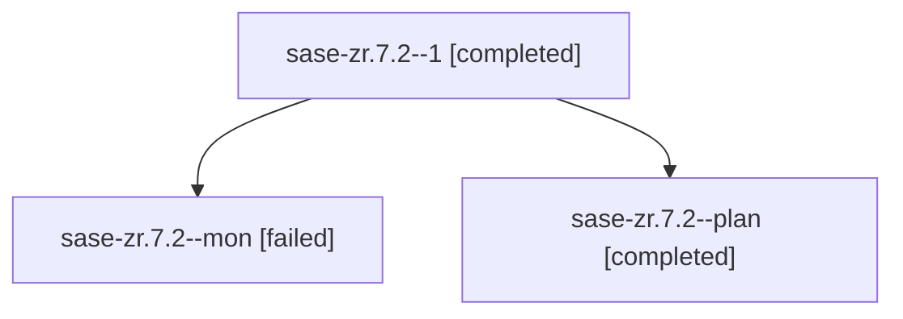

# Family: sase-zr.7.2

[Agent Hoods](../README.md) / [bbugyi200](../users/bbugyi200/README.md) / [apollo](../users/bbugyi200/machines/apollo/README.md) / [sase-zr](../users/bbugyi200/machines/apollo/hoods/sase-zr/README.md) / sase-zr.7.2

Owner: `bbugyi200.apollo` · Hood: `sase-zr` · Members: 3 · Bead: [sase-zr.7.2](https://github.com/sase-org/sase--beads/blob/main/pages/sase-zr/sase-zr.7.2.md)

## Lineage

The diagram is an optional enhancement; the ordered table below contains the same lineage in accessible text.

| Role | Agent | State | Model / provider | Timing | Commits | Prompt | Chat |
|---|---|---|---|---|---:|---|---|
| 1 | sase-zr.7.2--1 | completed | grok-4.6 / grok | 2026-09-19T15:35:09.558759+00:00 → 2026-09-19T16:58:16.609808+00:00 | [1](../agents/bbugyi200.apollo.sase-zr.7.2--1/README.md#commits) | [Prompt](../agents/bbugyi200.apollo.sase-zr.7.2--1/prompt.md) | [Chat](../agents/bbugyi200.apollo.sase-zr.7.2--1/chat.md) |
| mon | sase-zr.7.2--mon | failed | grok-4.6 / grok | 2026-09-19T15:02:14.956673+00:00 → 2026-09-19T15:35:09.610737+00:00 | 0 | — | [Chat](../agents/bbugyi200.apollo.sase-zr.7.2--mon/chat.md) |
| plan | sase-zr.7.2--plan | completed | grok-4.6 / grok | 2026-09-19T12:03:24.089175+00:00 → 2026-09-19T15:02:49.672208+00:00 | 0 | [Prompt](../agents/bbugyi200.apollo.sase-zr.7.2--plan/prompt.md) | [Chat](../agents/bbugyi200.apollo.sase-zr.7.2--plan/chat.md) |

## Commits

| Role | Repo | Commit | Subject | Committed |
|---|---|---|---|---|
| 1 | sase | [`bfc6142`](https://github.com/sase-org/sase/commit/bfc6142fcffb9500eb4a91a8f875be52946bda87) | feat(gates): project receipt-derived approval labels and honest commit status | 2026-09-19 12:54:23 EDT |

## Neighbors

| Agent | Relation | State |
|---|---|---|
| [sase-zr.7.1](bbugyi200.apollo.sase-zr.7.1.md) (family · 4) | sase-zr.7 hood | active 1, failed 3 |
| [sase-zr.7.1.1.1](../agents/bbugyi200.apollo.sase-zr.7.1.1.1/README.md) | sase-zr.7 hood | completed |
| [sase-zr.7.1.1.2](../agents/bbugyi200.apollo.sase-zr.7.1.1.2/README.md) | sase-zr.7 hood | completed |
| [sase-zr.7.1.1.3](../agents/bbugyi200.apollo.sase-zr.7.1.1.3/README.md) | sase-zr.7 hood | completed |
| [sase-zr.7.1.1.4](../agents/bbugyi200.apollo.sase-zr.7.1.1.4/README.md) | sase-zr.7 hood | completed |
| [sase-zr.7.1.1.5.1](../agents/bbugyi200.apollo.sase-zr.7.1.1.5.1/README.md) | sase-zr.7 hood | completed |
| [sase-zr.7.1.1.5.2](../agents/bbugyi200.apollo.sase-zr.7.1.1.5.2/README.md) | sase-zr.7 hood | completed |
| [sase-zr.7.1.1.5.3](../agents/bbugyi200.apollo.sase-zr.7.1.1.5.3/README.md) | sase-zr.7 hood | completed |
| [sase-zr.7.1.1.5.4.1](../agents/bbugyi200.apollo.sase-zr.7.1.1.5.4.1/README.md) | sase-zr.7 hood | completed |
| [sase-zr.7.1.1.5.4.2](bbugyi200.apollo.sase-zr.7.1.1.5.4.2.md) (family · 21) | sase-zr.7 hood | completed 11, failed 10 |
| [sase-zr.7.1.1.5.4.land](../agents/bbugyi200.apollo.sase-zr.7.1.1.5.4.land/README.md) | sase-zr.7 hood | completed |
| [sase-zr.7.1.1.5.land](bbugyi200.apollo.sase-zr.7.1.1.5.land.md) (family · 3) | sase-zr.7 hood | failed 3 |
| [sase-zr.7.1.1.land](bbugyi200.apollo.sase-zr.7.1.1.land.md) (family · 3) | sase-zr.7 hood | failed 3 |
| [sase-zr.7.3](../agents/bbugyi200.apollo.sase-zr.7.3/README.md) | sase-zr.7 hood | completed |
| [sase-zr.7.4](../agents/bbugyi200.apollo.sase-zr.7.4/README.md) | sase-zr.7 hood | completed |
| [sase-zr.7.5](../agents/bbugyi200.apollo.sase-zr.7.5/README.md) | sase-zr.7 hood | completed |
| [sase-zr.7.land](../agents/bbugyi200.apollo.sase-zr.7.land/README.md) | sase-zr.7 hood | active |
| [sase-zr.1](bbugyi200.apollo.sase-zr.1.md) (family · 5) | sase-zr hood | active 5 |
| [sase-zr.1](../agents/bbugyi200.apollo.sase-zr.1/README.md) | sase-zr hood | completed |
| [sase-zr.2](bbugyi200.apollo.sase-zr.2.md) (family · 3) | sase-zr hood | active 3 |
| [sase-zr.2](../agents/bbugyi200.apollo.sase-zr.2/README.md) | sase-zr hood | completed |
| [sase-zr.3](../agents/bbugyi200.apollo.sase-zr.3/README.md) | sase-zr hood | active |
| [sase-zr.4](../agents/bbugyi200.apollo.sase-zr.4/README.md) | sase-zr hood | active |
| [sase-zr.5](bbugyi200.apollo.sase-zr.5.md) (family · 3) | sase-zr hood | active 1, failed 2 |
| [sase-zr.6](bbugyi200.apollo.sase-zr.6.md) (family · 6) | sase-zr hood | active 6 |
| [sase-zr.land](../agents/bbugyi200.apollo.sase-zr.land/README.md) | sase-zr hood | waiting |
