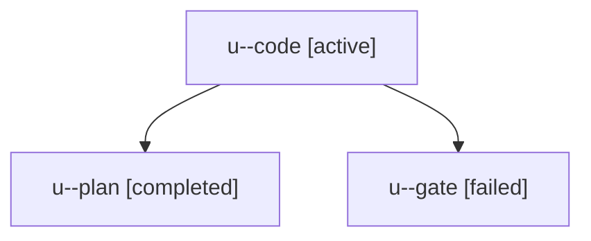

# Family: u

[Agent Hoods](../README.md) / [bbugyi200](../users/bbugyi200/README.md) / [apollo](../users/bbugyi200/machines/apollo/README.md) / [u](../users/bbugyi200/machines/apollo/hoods/u/README.md) / u

Owner: `bbugyi200.apollo` · Hood: `u` · Members: 3

## Lineage

The diagram is an optional enhancement; the ordered table below contains the same lineage in accessible text.

| Role | Agent | State | Model / provider | Timing | Commits | Prompt | Chat |
|---|---|---|---|---|---:|---|---|
| code | u--code | active | grok-4.6 / grok | 2026-09-13T21:58:58.693457+00:00 | [1](../agents/bbugyi200.apollo.u--code/README.md#commits) | [Prompt](../agents/bbugyi200.apollo.u--code/prompt.md) | — |
| plan | u--plan | completed | opus / claude | 2026-09-13T21:42:14.732816+00:00 → 2026-09-13T21:51:49.452439+00:00 | 0 | [Prompt](../agents/bbugyi200.apollo.u--plan/prompt.md) | [Chat](../agents/bbugyi200.apollo.u--plan/chat.md) |
| gate | u--gate | failed | opus / claude | 2026-09-13T21:58:39.693535+00:00 → 2026-09-13T21:58:55.582807+00:00 | 0 | — | [Chat](../agents/bbugyi200.apollo.u--gate/chat.md) |

## Commits

| Role | Repo | Commit | Subject | Committed |
|---|---|---|---|---|
| — | sase | [`3be27db`](https://github.com/sase-org/sase/commit/3be27dbe78067f86eabc715f64653c5adb4e3f1a) | chore: Add SDD prompt and plan for slow\_tool\_calls\_metadata\_panel | 2026-07-03 12:19:30 EDT |
| — | sase | [`4536419`](https://github.com/sase-org/sase/commit/4536419035284fb5064c9a09a964986362f6a8f0) | feat(tui): surface slow tool calls in agent metadata | 2026-07-03 13:03:03 EDT |
| — | sase | [`3fe09a7`](https://github.com/sase-org/sase/commit/3fe09a76c40be608c99ae193f6496372a2d11ac8) | chore: Add SDD prompt and plan for tab\_onboarding\_quickstart | 2026-07-06 19:33:22 EDT |
| — | sase | [`6fdd502`](https://github.com/sase-org/sase/commit/6fdd502c5a50387c54741830eb88893ec86acc28) | feat(tui): add tab quickstart onboarding | 2026-07-06 19:54:27 EDT |
| code | sase | [`0d36494`](https://github.com/sase-org/sase/commit/0d36494d25ec8bf03a897f1d3c5ad1ed330d6477) | feat(ace): add ,H leader chord to hint-collapse folds across tribes | 2026-09-13 19:12:21 EDT |
