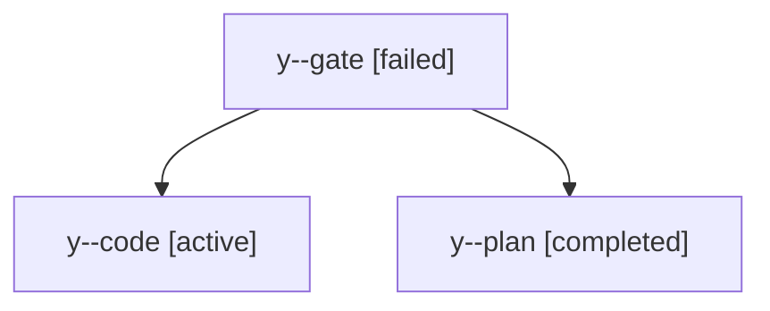

# Family: y

[Agent Hoods](../README.md) / [bbugyi200](../users/bbugyi200/README.md) / [apollo](../users/bbugyi200/machines/apollo/README.md) / [y](../users/bbugyi200/machines/apollo/hoods/y/README.md) / y

Owner: `bbugyi200.apollo` · Hood: `y` · Members: 3

## Lineage

The diagram is an optional enhancement; the ordered table below contains the same lineage in accessible text.

| Role | Agent | State | Model / provider | Timing | Commits | Prompt | Chat |
|---|---|---|---|---|---:|---|---|
| gate | y--gate | failed | opus / claude | 2026-09-14T13:01:10.472105+00:00 → 2026-09-14T13:01:43.511546+00:00 | 0 | — | [Chat](../agents/bbugyi200.apollo.y--gate/chat.md) |
| code | y--code | active | sonnet / claude | 2026-09-14T13:01:46.446019+00:00 | [1](../agents/bbugyi200.apollo.y--code/README.md#commits) | [Prompt](../agents/bbugyi200.apollo.y--code/prompt.md) | — |
| plan | y--plan | completed | opus / claude | 2026-09-14T12:52:40.424660+00:00 → 2026-09-14T13:01:12.678125+00:00 | 0 | [Prompt](../agents/bbugyi200.apollo.y--plan/prompt.md) | [Chat](../agents/bbugyi200.apollo.y--plan/chat.md) |

## Commits

| Role | Repo | Commit | Subject | Committed |
|---|---|---|---|---|
| — | sase | [`4add66d`](https://github.com/sase-org/sase/commit/4add66de85c2b06c5d38f9321a3ab0c65425f8d2) | chore: Add SDD prompt and plan for tui\_title\_version | 2026-07-03 14:43:19 EDT |
| — | sase | [`9deb012`](https://github.com/sase-org/sase/commit/9deb01206b0de988b6de7827e4ff6253631f0bc8) | feat(ace): show sase version instead of PID in the TUI title | 2026-07-03 15:40:55 EDT |
| — | sase | [`8b64dd4`](https://github.com/sase-org/sase/commit/8b64dd4b635acd86924fea5873cd723eb9bb7fbf) | chore: Add SDD prompt and plan for sase\_run\_skill\_prompt\_guidance | 2026-07-06 22:41:10 EDT |
| — | sase | [`2894fd2`](https://github.com/sase-org/sase/commit/2894fd280cc76debdc012de6a77ade37dc85b121) | docs: clarify sase\_run prompt composition | 2026-07-06 22:48:00 EDT |
| code | sase | [`e2d9d64`](https://github.com/sase-org/sase/commit/e2d9d64f1a70cb1770d36421f25681c001517fcb) | feat(pager): mute workspace root in trail chrome and titles | 2026-09-14 09:46:55 EDT |
