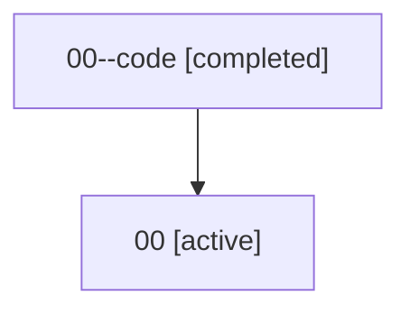

# Family: 00

[Agent Hoods](../README.md) / [bbugyi200](../users/bbugyi200/README.md) / [athena](../users/bbugyi200/machines/athena/README.md) / [00](../users/bbugyi200/machines/athena/hoods/00/README.md) / 00

Owner: `bbugyi200.athena` · Hood: `00` · Members: 2

## Lineage

The diagram is an optional enhancement; the ordered table below contains the same lineage in accessible text.

| Role | Agent | State | Model / provider | Timing | Commits | Prompt | Chat |
|---|---|---|---|---|---:|---|---|
| code | 00--code | completed | gpt-5.5 / codex | 2026-07-07T02:55:22.722769+00:00 | 0 | — | [Chat](../agents/bbugyi200.athena.00--code/chat.md) |
| root | 00 | active | claude-fable-5 / claude | 2026-07-07T02:44:57.251430+00:00 | [6](../agents/bbugyi200.athena.00/README.md#commits) | [Prompt](../agents/bbugyi200.athena.00/prompt.md) | [Chat](../agents/bbugyi200.athena.00/chat.md) |

## Commits

| Role | Commit | Subject | Committed (UTC) |
|---|---|---|---|
| root | [`b4de850`](https://github.com/sase-org/sase/commit/b4de85085391688a3241a59f81f93af8f7209bb0) | chore: Add SDD prompt and plan for fix\_space\_agent\_home | 2026-06-02 18:43:46 |
| root | [`397d4cc`](https://github.com/sase-org/sase/commit/397d4cc7e8241fbd3f62bb63b6d39bf2d28ad883) | fix: bind Space to home agent prompt | 2026-06-02 18:56:29 |
| root | [`dcff90d`](https://github.com/sase-org/sase/commit/dcff90d94f893c783d5676cfde85c0677cb73f8a) | chore: Add SDD prompt and plan for init\_command\_improvements | 2026-07-04 10:32:41 |
| root | [`4a23371`](https://github.com/sase-org/sase/commit/4a23371ec6fb28742d672b0057ba586e7e3a1e36) | feat(init): add skills check mode | 2026-07-04 11:00:49 |
| root | [`13e2d40`](https://github.com/sase-org/sase/commit/13e2d405767710900a5378828b581c08e1f9f54c) | chore: Add SDD prompt and plan for chat\_update\_builtin\_engine | 2026-07-07 02:55:21 |
| root | [`b718d92`](https://github.com/sase-org/sase/commit/b718d92b4e64a0e3026845c56664bf4361288a37) | feat!: use built-in chat update engine | 2026-07-07 03:11:18 |

## Neighbors

| Agent | Relation | State |
|---|---|---|
| [00.f1](../agents/bbugyi200.athena.00.f1/README.md) | descendant | completed |
| [00.w1](../agents/bbugyi200.athena.00.w1/README.md) | descendant | completed |
| [00.w1.r1](../agents/bbugyi200.athena.00.w1.r1/README.md) | descendant | completed |
| [00.w1.r1.w1](../agents/bbugyi200.athena.00.w1.r1.w1/README.md) | descendant | completed |
| [00.w1.r1.w1.f1](../agents/bbugyi200.athena.00.w1.r1.w1.f1/README.md) | descendant | completed |
| [00.w1.w1](../agents/bbugyi200.athena.00.w1.w1/README.md) | descendant | completed |
| [00.w1.w1.w1](../agents/bbugyi200.athena.00.w1.w1.w1/README.md) | descendant | completed |
| [00.w1.w1.w1.f1](../agents/bbugyi200.athena.00.w1.w1.w1.f1/README.md) | descendant | completed |
