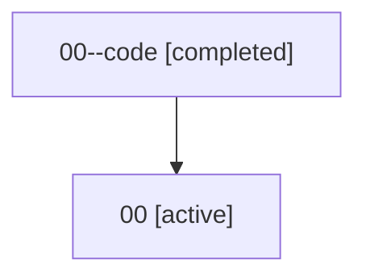

# Family: 00

Owner: `bbugyi200.athena` · Hood: `00` · Members: 2

## Lineage

The diagram is an optional enhancement; the ordered table below contains the same lineage in accessible text.

| Role | Agent | State | Model / provider | Timing | Commits | Prompt | Chat |
|---|---|---|---|---|---:|---|---|
| code | 00--code | completed | gpt-5.5 / codex | 2026-07-07T02:55:22.722769+00:00 | 0 | — | [Chat](../agents/bbugyi200.athena.00--code/chat.md) |
| root | 00 | active | claude-fable-5 / claude | 2026-07-07T02:44:57.251430+00:00 | 6 | [Prompt](../agents/bbugyi200.athena.00/prompt.md) | [Chat](../agents/bbugyi200.athena.00/chat.md) |
