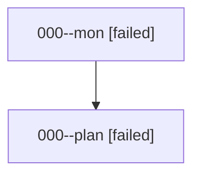

# Family: 000

[Agent Hoods](../README.md) / [bbugyi200](../users/bbugyi200/README.md) / [athena](../users/bbugyi200/machines/athena/README.md) / [000](../users/bbugyi200/machines/athena/hoods/000/README.md) / 000

Owner: `bbugyi200.athena` · Hood: `000` · Members: 2

## Lineage

The diagram is an optional enhancement; the ordered table below contains the same lineage in accessible text.

| Role | Agent | State | Model / provider | Timing | Commits | Prompt | Chat |
|---|---|---|---|---|---:|---|---|
| mon | 000--mon | failed | gpt-5.6-sol / codex | 2026-08-13T21:18:15.847992+00:00 | 0 | — | [Chat](../agents/bbugyi200.athena.000--mon/chat.md) |
| plan | 000--plan | failed | gpt-5.6-sol / codex | 2026-08-13T21:06:55.900445+00:00 | 0 | [Prompt](../agents/bbugyi200.athena.000--plan/prompt.md) | [Chat](../agents/bbugyi200.athena.000--plan/chat.md) |

## Commits

| Role | Repo | Commit | Subject | Committed |
|---|---|---|---|---|
| — | sase | [`9026fdb`](https://github.com/sase-org/sase/commit/9026fdbc353857d5279390cd03dde4808a3a90fd) | chore: Add SDD prompt and plan for prompt\_search\_escape\_clear | 2026-06-18 11:43:03 UTC |
| — | sase | [`b2c9905`](https://github.com/sase-org/sase/commit/b2c9905c369873cd7115540d8b95c06a9bd64bec) | fix(tui): clear prompt search highlights on escape | 2026-06-18 11:51:40 UTC |
