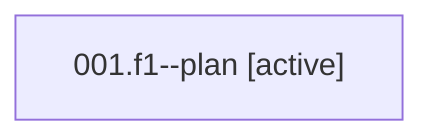

# Family: 001.f1

[Agent Hoods](../README.md) / [bbugyi200](../users/bbugyi200/README.md) / [athena](../users/bbugyi200/machines/athena/README.md) / [001](../users/bbugyi200/machines/athena/hoods/001/README.md) / 001.f1

Owner: `bbugyi200.athena` · Hood: `001` · Members: 1

## Lineage

The diagram is an optional enhancement; the ordered table below contains the same lineage in accessible text.

| Role | Agent | State | Model / provider | Timing | Commits | Prompt | Chat |
|---|---|---|---|---|---:|---|---|
| plan | 001.f1--plan | active | opus / claude | 2026-08-13T23:30:03.675722+00:00 | 0 | [Prompt](../agents/bbugyi200.athena.001.f1--plan/prompt.md) | [Chat](../agents/bbugyi200.athena.001.f1--plan/chat.md) |

## Neighbors

| Agent | Relation | State |
|---|---|---|
| [001](../agents/bbugyi200.athena.001/README.md) | ancestor | completed |
