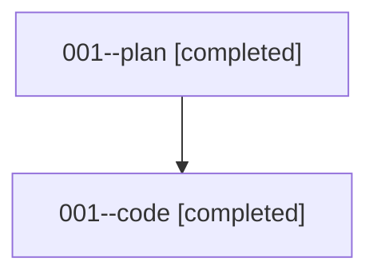

# Family: 001

[Agent Hoods](../README.md) / [bbugyi200](../users/bbugyi200/README.md) / [athena](../users/bbugyi200/machines/athena/README.md) / [001](../users/bbugyi200/machines/athena/hoods/001/README.md) / 001

Owner: `bbugyi200.athena` · Hood: `001` · Members: 2

## Lineage

The diagram is an optional enhancement; the ordered table below contains the same lineage in accessible text.

| Role | Agent | State | Model / provider | Timing | Commits | Prompt | Chat |
|---|---|---|---|---|---:|---|---|
| plan | 001--plan | completed | opus / claude | 2026-08-13T21:33:15.913825+00:00 | 0 | [Prompt](../agents/bbugyi200.athena.001--plan/prompt.md) | [Chat](../agents/bbugyi200.athena.001--plan/chat.md) |
| code | 001--code | completed | sonnet / claude | 2026-08-13T21:49:36.650051+00:00 | 0 | — | [Chat](../agents/bbugyi200.athena.001--code/chat.md) |

## Commits

| Role | Repo | Commit | Subject | Committed |
|---|---|---|---|---|
| — | sase | [`4375a97`](https://github.com/sase-org/sase/commit/4375a979133848a741f3bbecb5e64329eed5cad4) | chore: Add SDD prompt and plan for prompt\_insert\_ctrl\_g\_prefix | 2026-06-18 08:01:48 EDT |
| — | sase | [`d4dd47d`](https://github.com/sase-org/sase/commit/d4dd47dd5272dc047f2adb3e64dca5030f90b38a) | feat(tui)!: add prompt Ctrl+G insert prefix | 2026-06-18 08:24:42 EDT |

## Neighbors

| Agent | Relation | State |
|---|---|---|
| [001.f0](../agents/bbugyi200.athena.001.f0/README.md) | descendant | waiting |
