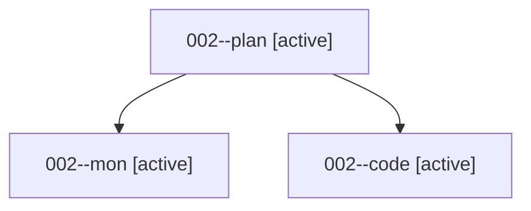

# Family: 002

[Agent Hoods](../README.md) / [bbugyi200](../users/bbugyi200/README.md) / [athena](../users/bbugyi200/machines/athena/README.md) / [002](../users/bbugyi200/machines/athena/hoods/002/README.md) / 002

Owner: `bbugyi200.athena` · Hood: `002` · Members: 3

## Lineage

The diagram is an optional enhancement; the ordered table below contains the same lineage in accessible text.

| Role | Agent | State | Model / provider | Timing | Commits | Prompt | Chat |
|---|---|---|---|---|---:|---|---|
| plan | 002--plan | active | opus / claude | 2026-08-13T21:38:06.384113+00:00 | 0 | [Prompt](../agents/bbugyi200.athena.002--plan/prompt.md) | [Chat](../agents/bbugyi200.athena.002--plan/chat.md) |
| mon | 002--mon | active | gpt-5.5 / codex | 2026-08-13T22:10:13.471196+00:00 | 0 | — | — |
| code | 002--code | active | gpt-5.5 / codex | 2026-08-13T21:50:59.552463+00:00 | [1](../agents/bbugyi200.athena.002--code/README.md#commits) | — | — |

## Commits

| Role | Repo | Commit | Subject | Committed |
|---|---|---|---|---|
| — | sase | [`d5d2dfa`](https://github.com/sase-org/sase/commit/d5d2dfaf0d6a2ad9d6c6c29c775aaa0c4373c99c) | chore: Add SDD prompt and plan for bead\_search\_command | 2026-06-18 08:12:52 EDT |
| — | sase | [`5254b39`](https://github.com/sase-org/sase/commit/5254b3905b992a090714af3cbbf7efa5ede9f737) | chore(beads): add bead search epic plan beads | 2026-06-18 08:18:13 EDT |
| code | sase | [`2e2facb`](https://github.com/sase-org/sase/commit/2e2facb945fb9a9461b14ff2788525b41764fbc7) | fix: release monitor handoff waits after successor success | 2026-08-13 18:11:40 EDT |
