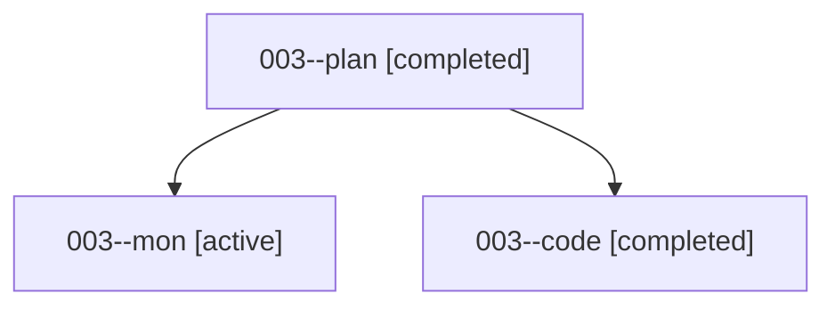

# Family: 003

[Agent Hoods](../README.md) / [bbugyi200](../users/bbugyi200/README.md) / [athena](../users/bbugyi200/machines/athena/README.md) / [003](../users/bbugyi200/machines/athena/hoods/003/README.md) / 003

Owner: `bbugyi200.athena` · Hood: `003` · Members: 3

## Lineage

The diagram is an optional enhancement; the ordered table below contains the same lineage in accessible text.

| Role | Agent | State | Model / provider | Timing | Commits | Prompt | Chat |
|---|---|---|---|---|---:|---|---|
| plan | 003--plan | completed | gpt-5.6-sol / codex | 2026-08-13T21:57:34.969467+00:00 | 0 | [Prompt](../agents/bbugyi200.athena.003--plan/prompt.md) | [Chat](../agents/bbugyi200.athena.003--plan/chat.md) |
| mon | 003--mon | active | gpt-5.5 / codex | 2026-08-13T23:06:33.004031+00:00 | 0 | — | — |
| code | 003--code | completed | gpt-5.5 / codex | 2026-08-13T22:12:39.163749+00:00 | [1](../agents/bbugyi200.athena.003--code/README.md#commits) | — | [Chat](../agents/bbugyi200.athena.003--code/chat.md) |

## Commits

| Role | Repo | Commit | Subject | Committed |
|---|---|---|---|---|
| code | sase | [`10e33da`](https://github.com/sase-org/sase/commit/10e33da429983062f59212bfb9a32ae2b7eadbe1) | fix: classify monitor starter rows as regular agents | 2026-08-13 23:07:51 UTC |

## Neighbors

| Agent | Relation | State |
|---|---|---|
| [003.cld](../agents/bbugyi200.athena.003.cld/README.md) | descendant | completed |
