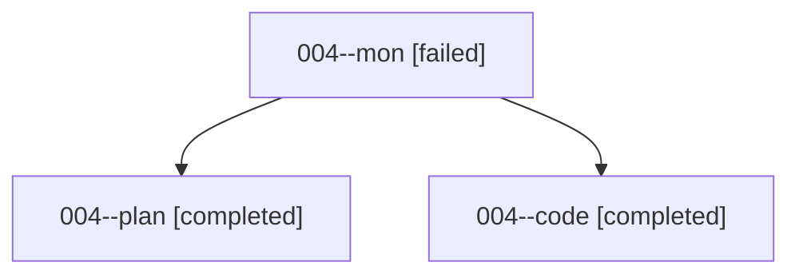

# Family: 004

[Agent Hoods](../README.md) / [bbugyi200](../users/bbugyi200/README.md) / [athena](../users/bbugyi200/machines/athena/README.md) / [004](../users/bbugyi200/machines/athena/hoods/004/README.md) / 004

Owner: `bbugyi200.athena` · Hood: `004` · Members: 3

## Lineage

The diagram is an optional enhancement; the ordered table below contains the same lineage in accessible text.

| Role | Agent | State | Model / provider | Timing | Commits | Prompt | Chat |
|---|---|---|---|---|---:|---|---|
| mon | 004--mon | failed | gpt-5.5 / codex | 2026-08-13T22:34:28.274624+00:00 | 0 | — | [Chat](../agents/bbugyi200.athena.004--mon/chat.md) |
| plan | 004--plan | completed | gpt-5.6-sol / codex | 2026-08-13T22:16:48.490010+00:00 | 0 | [Prompt](../agents/bbugyi200.athena.004--plan/prompt.md) | [Chat](../agents/bbugyi200.athena.004--plan/chat.md) |
| code | 004--code | completed | gpt-5.5 / codex | 2026-08-13T22:30:37.547520+00:00 | 0 | — | [Chat](../agents/bbugyi200.athena.004--code/chat.md) |
