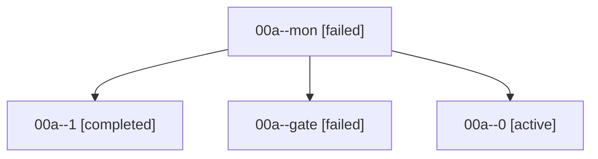

# Family: 00a

[Agent Hoods](../README.md) / [bbugyi200](../users/bbugyi200/README.md) / [athena](../users/bbugyi200/machines/athena/README.md) / [00a](../users/bbugyi200/machines/athena/hoods/00a/README.md) / 00a

Owner: `bbugyi200.athena` · Hood: `00a` · Members: 4

## Lineage

The diagram is an optional enhancement; the ordered table below contains the same lineage in accessible text.

| Role | Agent | State | Model / provider | Timing | Commits | Prompt | Chat |
|---|---|---|---|---|---:|---|---|
| mon | 00a--mon | failed | gpt-6-astra / codex | 2026-09-06T23:27:30.483340+00:00 → 2026-09-06T23:30:04.026681+00:00 | 0 | — | [Chat](../agents/bbugyi200.athena.00a--mon/chat.md) |
| 1 | 00a--1 | completed | gpt-6-astra / codex | 2026-09-06T23:30:37.815591+00:00 → 2026-09-06T23:53:59.284603+00:00 | 0 | [Prompt](../agents/bbugyi200.athena.00a--1/prompt.md) | [Chat](../agents/bbugyi200.athena.00a--1/chat.md) |
| gate | 00a--gate | failed | gpt-6-astra / codex | 2026-09-06T23:53:48.144176+00:00 → 2026-09-07T00:30:04.971875+00:00 | 0 | — | [Chat](../agents/bbugyi200.athena.00a--gate/chat.md) |
| 0 | 00a--0 | active | gpt-6-astra / codex | 2026-09-06T23:19:30.862435+00:00 | 0 | [Prompt](../agents/bbugyi200.athena.00a--0/prompt.md) | [Chat](../agents/bbugyi200.athena.00a--0/chat.md) |

## Commits

| Role | Repo | Commit | Subject | Committed |
|---|---|---|---|---|
| — | sase | [`cc5b1ea`](https://github.com/sase-org/sase/commit/cc5b1ea66620a8bbf433791fc79fc5ef259b4cb2) | chore: Add SDD prompt and plan for frontmatter\_add\_property\_picker | 2026-06-18 09:19:53 EDT |
| — | sase | [`6fbc748`](https://github.com/sase-org/sase/commit/6fbc748f52453eed1a31ba253ca904ef2a93bd41) | feat(tui): improve frontmatter add-property picker | 2026-06-18 09:33:46 EDT |
