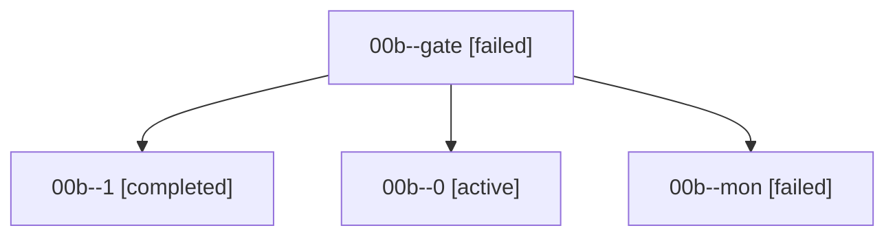

# Family: 00b

[Agent Hoods](../README.md) / [bbugyi200](../users/bbugyi200/README.md) / [athena](../users/bbugyi200/machines/athena/README.md) / [00b](../users/bbugyi200/machines/athena/hoods/00b/README.md) / 00b

Owner: `bbugyi200.athena` · Hood: `00b` · Members: 4

## Lineage

The diagram is an optional enhancement; the ordered table below contains the same lineage in accessible text.

| Role | Agent | State | Model / provider | Timing | Commits | Prompt | Chat |
|---|---|---|---|---|---:|---|---|
| gate | 00b--gate | failed | gpt-6-astra / codex | 2026-09-07T00:55:03.260000+00:00 → 2026-09-07T01:44:04.066360+00:00 | 0 | — | [Chat](../agents/bbugyi200.athena.00b--gate/chat.md) |
| 1 | 00b--1 | completed | gpt-6-astra / codex | 2026-09-07T00:47:49.904690+00:00 → 2026-09-07T00:55:40.441640+00:00 | 0 | [Prompt](../agents/bbugyi200.athena.00b--1/prompt.md) | [Chat](../agents/bbugyi200.athena.00b--1/chat.md) |
| 0 | 00b--0 | active | gpt-6-astra / codex | 2026-09-07T00:35:23.522644+00:00 | 0 | [Prompt](../agents/bbugyi200.athena.00b--0/prompt.md) | [Chat](../agents/bbugyi200.athena.00b--0/chat.md) |
| mon | 00b--mon | failed | gpt-6-astra / codex | 2026-09-07T00:44:47.644587+00:00 → 2026-09-07T00:47:24.727984+00:00 | 0 | — | [Chat](../agents/bbugyi200.athena.00b--mon/chat.md) |

## Commits

| Role | Repo | Commit | Subject | Committed |
|---|---|---|---|---|
| — | sase | [`b4e143e`](https://github.com/sase-org/sase/commit/b4e143ee407466dbba16aab0e084481732507535) | chore: Add SDD prompt and plan for agent\_group\_auto\_add | 2026-06-18 09:59:28 EDT |
| — | sase | [`7862d83`](https://github.com/sase-org/sase/commit/7862d83745e5c213b4b8831e98f3c414481a46a9) | feat(agents): auto-add derived agent names to groups | 2026-06-18 10:13:13 EDT |
