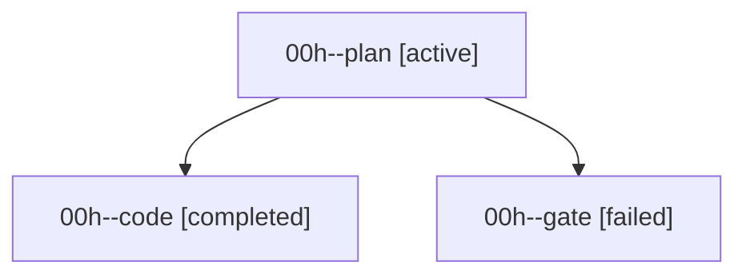

# Family: 00h

[Agent Hoods](../README.md) / [bbugyi200](../users/bbugyi200/README.md) / [athena](../users/bbugyi200/machines/athena/README.md) / [00h](../users/bbugyi200/machines/athena/hoods/00h/README.md) / 00h

Owner: `bbugyi200.athena` · Hood: `00h` · Members: 3

## Lineage

The diagram is an optional enhancement; the ordered table below contains the same lineage in accessible text.

| Role | Agent | State | Model / provider | Timing | Commits | Prompt | Chat |
|---|---|---|---|---|---:|---|---|
| plan | 00h--plan | active | gpt-6-astra / codex | 2026-09-07T01:35:04.075310+00:00 | 0 | [Prompt](../agents/bbugyi200.athena.00h--plan/prompt.md) | [Chat](../agents/bbugyi200.athena.00h--plan/chat.md) |
| code | 00h--code | completed | gpt-5.5 / codex | 2026-09-07T01:43:32.701837+00:00 → 2026-09-07T03:20:33.370391+00:00 | [1](../agents/bbugyi200.athena.00h--code/README.md#commits) | [Prompt](../agents/bbugyi200.athena.00h--code/prompt.md) | [Chat](../agents/bbugyi200.athena.00h--code/chat.md) |
| gate | 00h--gate | failed | gpt-6-astra / codex | 2026-09-07T01:41:57.586242+00:00 → 2026-09-07T01:43:24.996815+00:00 | 0 | — | [Chat](../agents/bbugyi200.athena.00h--gate/chat.md) |

## Commits

| Role | Repo | Commit | Subject | Committed |
|---|---|---|---|---|
| — | sase | [`d6acb3f`](https://github.com/sase-org/sase/commit/d6acb3f6e4524d4c58f0ebca9d4aa7923469fb2b) | chore: Add SDD prompt and plan for remove\_sase\_git | 2026-06-18 14:31:05 EDT |
| — | sase | [`70651ab`](https://github.com/sase-org/sase/commit/70651abeb701f0cbf1817ca4cfc86463e24270e5) | feat(cli)!: remove sase git init | 2026-06-18 14:38:27 EDT |
| code | sase | [`53c262a`](https://github.com/sase-org/sase/commit/53c262a096b85de5f61cf17fd3f8705fe4a934c2) | fix(axe): retain subprocess diagnostics in error digests | 2026-09-06 23:12:21 EDT |
