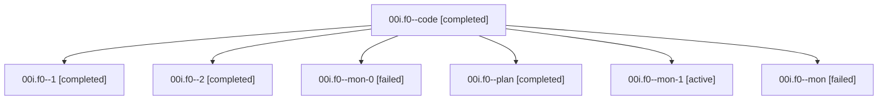

# Family: 00i.f0

[Agent Hoods](../README.md) / [bbugyi200](../users/bbugyi200/README.md) / [athena](../users/bbugyi200/machines/athena/README.md) / [00i](../users/bbugyi200/machines/athena/hoods/00i/README.md) / 00i.f0

Owner: `bbugyi200.athena` · Hood: `00i` · Members: 7

## Lineage

The diagram is an optional enhancement; the ordered table below contains the same lineage in accessible text.

| Role | Agent | State | Model / provider | Timing | Commits | Prompt | Chat |
|---|---|---|---|---|---:|---|---|
| code | 00i.f0--code | completed | sonnet / claude | 2026-08-14T11:29:27.396149+00:00 | 0 | — | [Chat](../agents/bbugyi200.athena.00i.f0--code/chat.md) |
| 1 | 00i.f0--1 | completed | sonnet / claude | 2026-08-14T11:53:59.197647+00:00 | 0 | [Prompt](../agents/bbugyi200.athena.00i.f0--1/prompt.md) | [Chat](../agents/bbugyi200.athena.00i.f0--1/chat.md) |
| 2 | 00i.f0--2 | completed | sonnet / claude | 2026-08-14T11:55:09.202688+00:00 | 0 | [Prompt](../agents/bbugyi200.athena.00i.f0--2/prompt.md) | [Chat](../agents/bbugyi200.athena.00i.f0--2/chat.md) |
| mon-0 | 00i.f0--mon-0 | failed | sonnet / claude | 2026-08-14T11:54:43.579309+00:00 | 0 | — | [Chat](../agents/bbugyi200.athena.00i.f0--mon-0/chat.md) |
| plan | 00i.f0--plan | completed | opus / claude | 2026-08-14T11:18:19.662512+00:00 | 0 | [Prompt](../agents/bbugyi200.athena.00i.f0--plan/prompt.md) | [Chat](../agents/bbugyi200.athena.00i.f0--plan/chat.md) |
| mon-1 | 00i.f0--mon-1 | active | sonnet / claude | 2026-08-14T11:55:42.938817+00:00 | 0 | — | — |
| mon | 00i.f0--mon | failed | sonnet / claude | 2026-08-14T11:53:16.827871+00:00 | 0 | — | [Chat](../agents/bbugyi200.athena.00i.f0--mon/chat.md) |

## Neighbors

| Agent | Relation | State |
|---|---|---|
| [00i](../agents/bbugyi200.athena.00i/README.md) | ancestor | completed |
