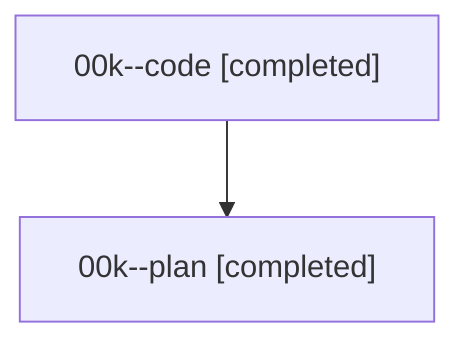

# Family: 00k

[Agent Hoods](../README.md) / [bbugyi200](../users/bbugyi200/README.md) / [athena](../users/bbugyi200/machines/athena/README.md) / [00k](../users/bbugyi200/machines/athena/hoods/00k/README.md) / 00k

Owner: `bbugyi200.athena` · Hood: `00k` · Members: 2

## Lineage

The diagram is an optional enhancement; the ordered table below contains the same lineage in accessible text.

| Role | Agent | State | Model / provider | Timing | Commits | Prompt | Chat |
|---|---|---|---|---|---:|---|---|
| code | 00k--code | completed | sonnet / claude | 2026-08-14T11:50:03.587145+00:00 | 0 | — | [Chat](../agents/bbugyi200.athena.00k--code/chat.md) |
| plan | 00k--plan | completed | opus / claude | 2026-08-14T11:44:58.766555+00:00 | 0 | [Prompt](../agents/bbugyi200.athena.00k--plan/prompt.md) | [Chat](../agents/bbugyi200.athena.00k--plan/chat.md) |
