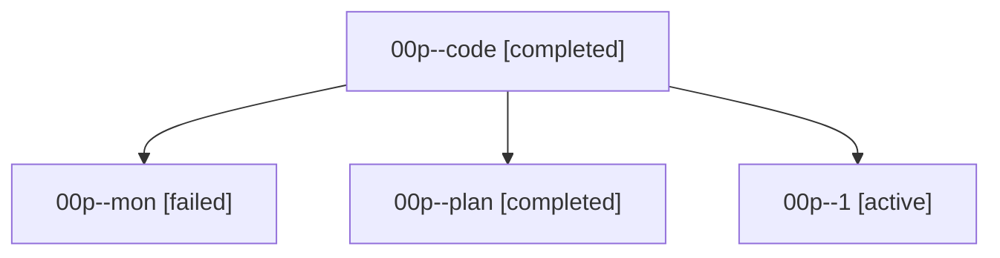

# Family: 00p

[Agent Hoods](../README.md) / [bbugyi200](../users/bbugyi200/README.md) / [athena](../users/bbugyi200/machines/athena/README.md) / [00p](../users/bbugyi200/machines/athena/hoods/00p/README.md) / 00p

Owner: `bbugyi200.athena` · Hood: `00p` · Members: 4

## Lineage

The diagram is an optional enhancement; the ordered table below contains the same lineage in accessible text.

| Role | Agent | State | Model / provider | Timing | Commits | Prompt | Chat |
|---|---|---|---|---|---:|---|---|
| code | 00p--code | completed | sonnet / claude | 2026-08-14T12:11:41.122573+00:00 | 0 | — | [Chat](../agents/bbugyi200.athena.00p--code/chat.md) |
| mon | 00p--mon | failed | sonnet / claude | 2026-08-14T12:23:06.116835+00:00 | 0 | — | [Chat](../agents/bbugyi200.athena.00p--mon/chat.md) |
| plan | 00p--plan | completed | opus / claude | 2026-08-14T12:01:27.346759+00:00 | 0 | [Prompt](../agents/bbugyi200.athena.00p--plan/prompt.md) | [Chat](../agents/bbugyi200.athena.00p--plan/chat.md) |
| 1 | 00p--1 | active | sonnet / claude | 2026-08-14T12:27:32.011585+00:00 | [1](../agents/bbugyi200.athena.00p--1/README.md#commits) | [Prompt](../agents/bbugyi200.athena.00p--1/prompt.md) | — |

## Commits

| Role | Repo | Commit | Subject | Committed |
|---|---|---|---|---|
| — | sase | [`f5b2729`](https://github.com/sase-org/sase/commit/f5b272914a8c20f13ac9f884d113a52c57e84330) | chore: Add SDD prompt and plan for prompt\_search\_command | 2026-06-19 01:25:10 UTC |
| 1 | sase | [`8147915`](https://github.com/sase-org/sase/commit/8147915b76405e1e65bc0b33fb98e3585b389d34) | fix(ace): surface active monitors through their agent-family root | 2026-08-14 12:28:37 UTC |
